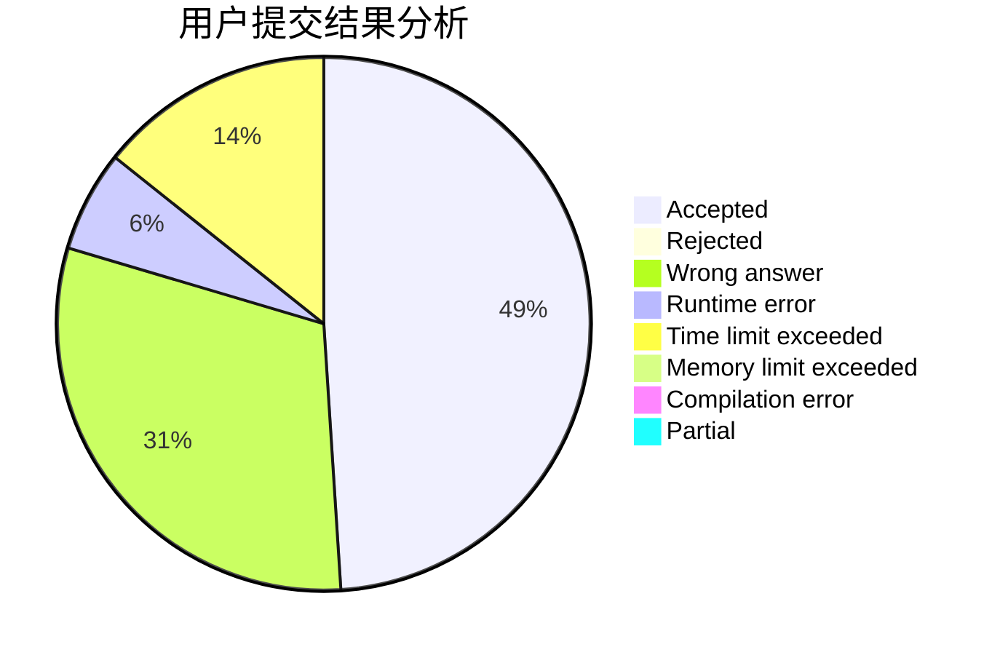
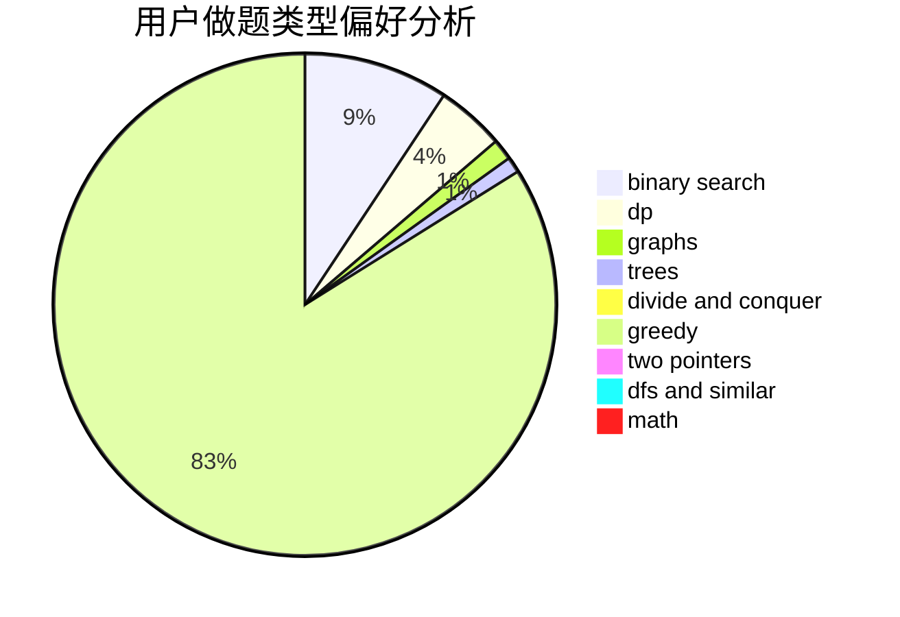

# ygsldcyc

<!-- tabs:start -->

#### **用户提交结果分析**

#### **用户做题类型偏好分析**

<!-- tabs:end -->
# 推荐题目
[715A](https://codeforces.com/contest/715/problem/A)
[1087D](https://codeforces.com/contest/1087/problem/D)
[293B](https://codeforces.com/contest/293/problem/B)
[501E](https://codeforces.com/contest/501/problem/E)
[920G](https://codeforces.com/contest/920/problem/G)
[acmsguru5](https://codeforces.com/contest/acmsguru/problem/5)
[212A](https://codeforces.com/contest/212/problem/A)
[1073B](https://codeforces.com/contest/1073/problem/B)
[1036C](https://codeforces.com/contest/1036/problem/C)
[750E](https://codeforces.com/contest/750/problem/E)
