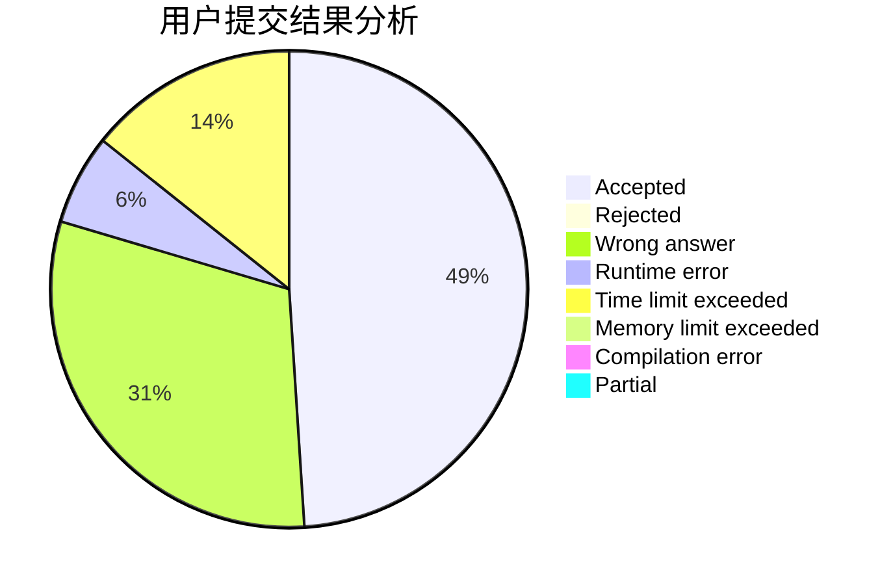
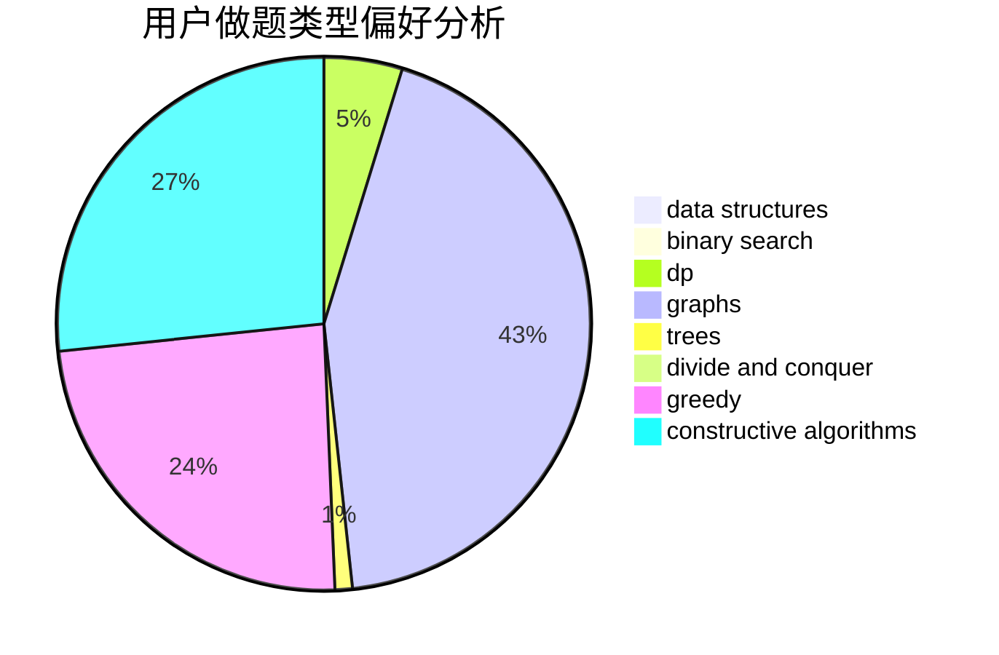
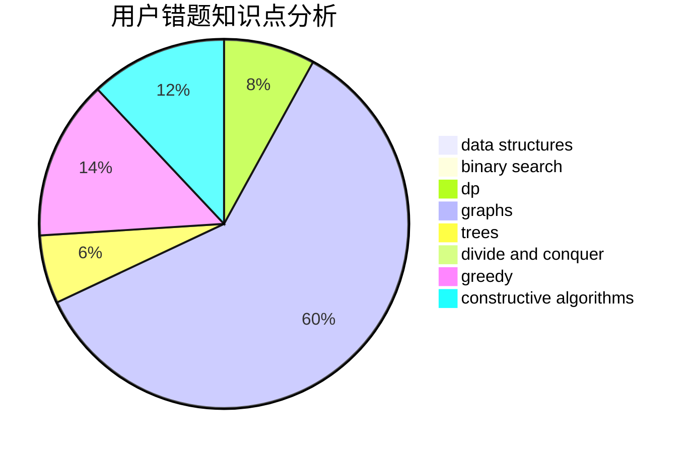

# ygsldcyc

<!-- tabs:start -->

#### **用户提交结果分析**

#### **用户做题类型偏好分析**

#### **用户错题知识点分析**

<!-- tabs:end -->
# 推荐题目
[698C](https://codeforces.com/contest/698/problem/C)		bitmasks,
                        dp,
                        math,
                        probabilities		  
[1087A](https://codeforces.com/contest/1087/problem/A)		dsu,graphs,sortings,trees		  
[278B](https://codeforces.com/contest/278/problem/B)		brute force,
                        strings		  
[482E](https://codeforces.com/contest/482/problem/E)		data structures,
                        trees		  
[907C](https://codeforces.com/contest/907/problem/C)		dsu,graphs,sortings,trees		  
[986C](https://codeforces.com/contest/986/problem/C)		bitmasks,
                        dfs and similar,
                        dsu,
                        graphs		  
[186C](https://codeforces.com/contest/186/problem/C)		dsu,graphs,sortings,trees		  
[1072C](https://codeforces.com/contest/1072/problem/C)		dsu,graphs,sortings,trees		  
[1034E](https://codeforces.com/contest/1034/problem/E)		bitmasks,
                        dp,
                        math		  
[732F](https://codeforces.com/contest/732/problem/F)		dfs and similar,
                        graphs		  
