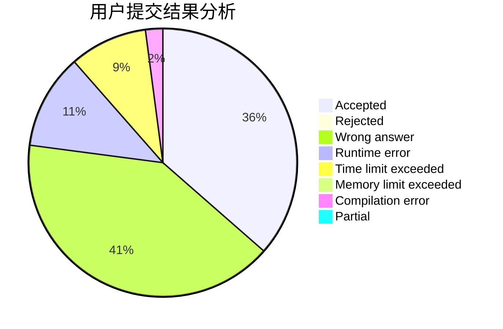
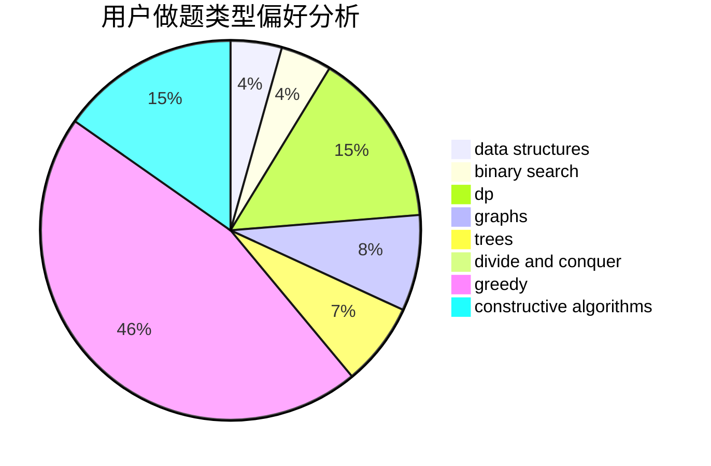
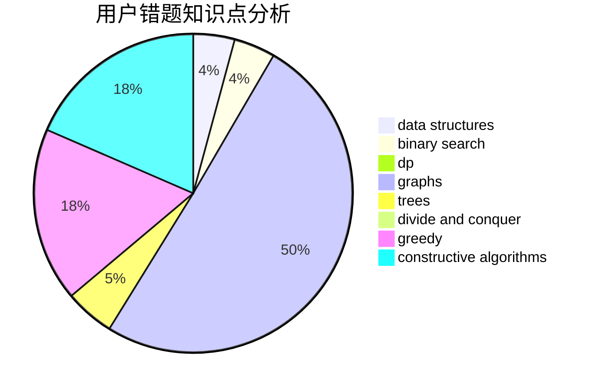

# ChaosElige

<!-- tabs:start -->

#### **用户提交结果分析**

#### **用户做题类型偏好分析**

#### **用户错题知识点分析**

<!-- tabs:end -->
# 推荐题目
[1146A](https://codeforces.com/contest/1146/problem/A)		implementation,
                        strings		  
[182D](https://codeforces.com/contest/182/problem/D)		brute force,
                        hashing,
                        implementation,
                        math,
                        strings		  
[1025G](https://codeforces.com/contest/1025/problem/G)		constructive algorithms,
                        math		  
[436F](https://codeforces.com/contest/436/problem/F)		brute force,
                        data structures,
                        dp		  
[1090B](https://codeforces.com/contest/1090/problem/B)		nan		  
[325B](https://codeforces.com/contest/325/problem/B)		binary search,
                        math		  
[1085G](https://codeforces.com/contest/1085/problem/G)		combinatorics,
                        data structures,
                        dp		  
[686D](https://codeforces.com/contest/686/problem/D)		dsu,graphs,sortings,trees		  
[238A](https://codeforces.com/contest/238/problem/A)		constructive algorithms,
                        math		  
[1200A](https://codeforces.com/contest/1200/problem/A)		brute force,
                        data structures,
                        implementation		  
