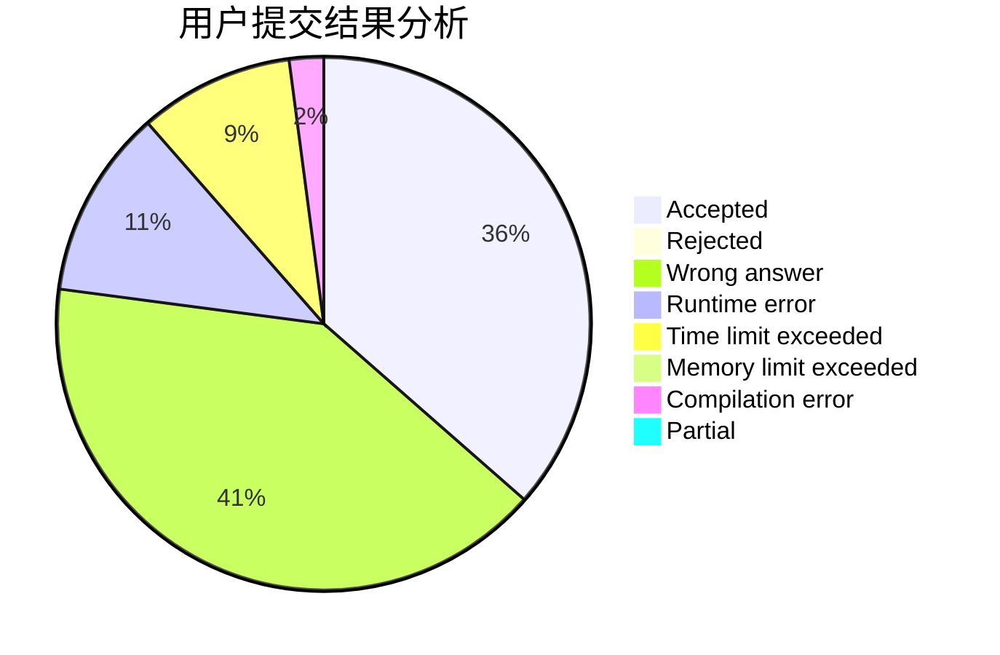
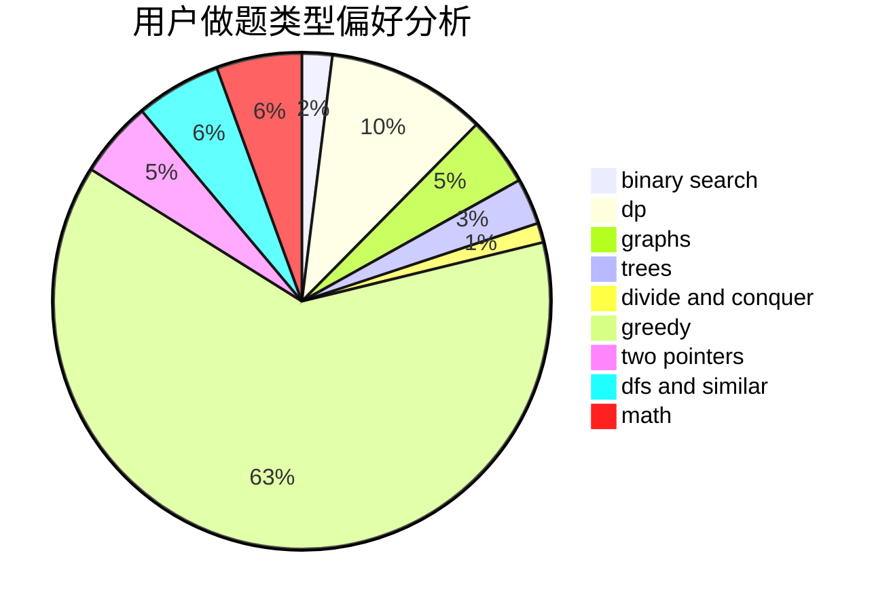

# ChaosElige

<!-- tabs:start -->

#### **用户提交结果分析**

#### **用户做题类型偏好分析**

<!-- tabs:end -->
# 推荐题目
[1146A](https://codeforces.com/contest/1146/problem/A)
[182D](https://codeforces.com/contest/182/problem/D)
[1025G](https://codeforces.com/contest/1025/problem/G)
[436F](https://codeforces.com/contest/436/problem/F)
[1090B](https://codeforces.com/contest/1090/problem/B)
[325B](https://codeforces.com/contest/325/problem/B)
[1085G](https://codeforces.com/contest/1085/problem/G)
[686D](https://codeforces.com/contest/686/problem/D)
[238A](https://codeforces.com/contest/238/problem/A)
[1200A](https://codeforces.com/contest/1200/problem/A)
