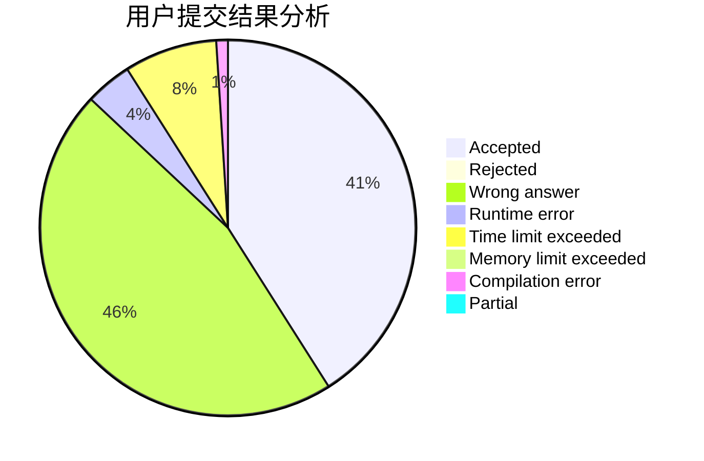
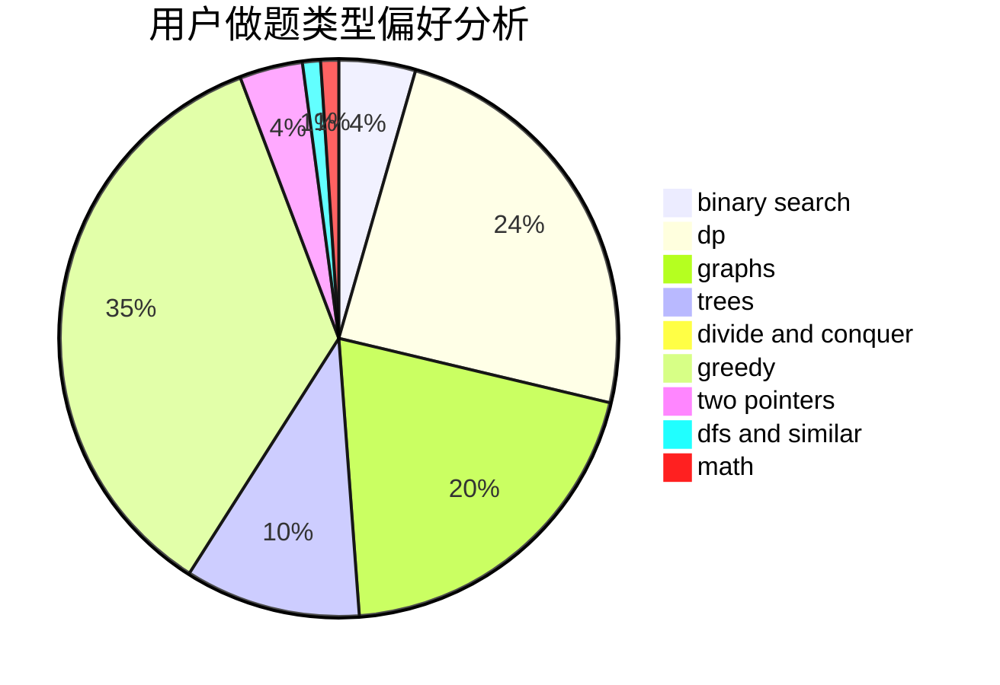

# ygy

<!-- tabs:start -->

#### **用户提交结果分析**

#### **用户做题类型偏好分析**

<!-- tabs:end -->
# 推荐题目
[559A](https://codeforces.com/contest/559/problem/A)
[371C](https://codeforces.com/contest/371/problem/C)
[1333D](https://codeforces.com/contest/1333/problem/D)
[1005A](https://codeforces.com/contest/1005/problem/A)
[268B](https://codeforces.com/contest/268/problem/B)
[13B](https://codeforces.com/contest/13/problem/B)
[11412](https://codeforces.com/contest/1141/problem/2)
[821D](https://codeforces.com/contest/821/problem/D)
[863D](https://codeforces.com/contest/863/problem/D)
[1366G](https://codeforces.com/contest/1366/problem/G)
