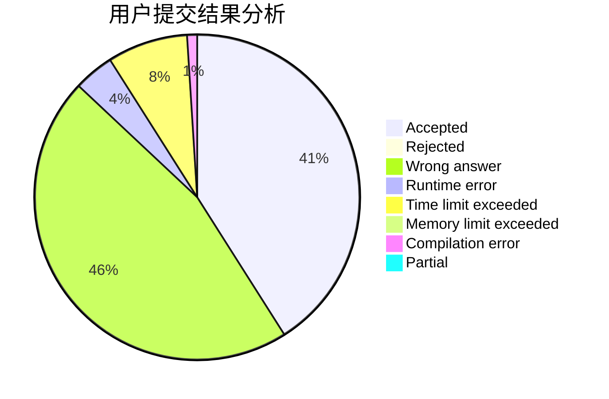
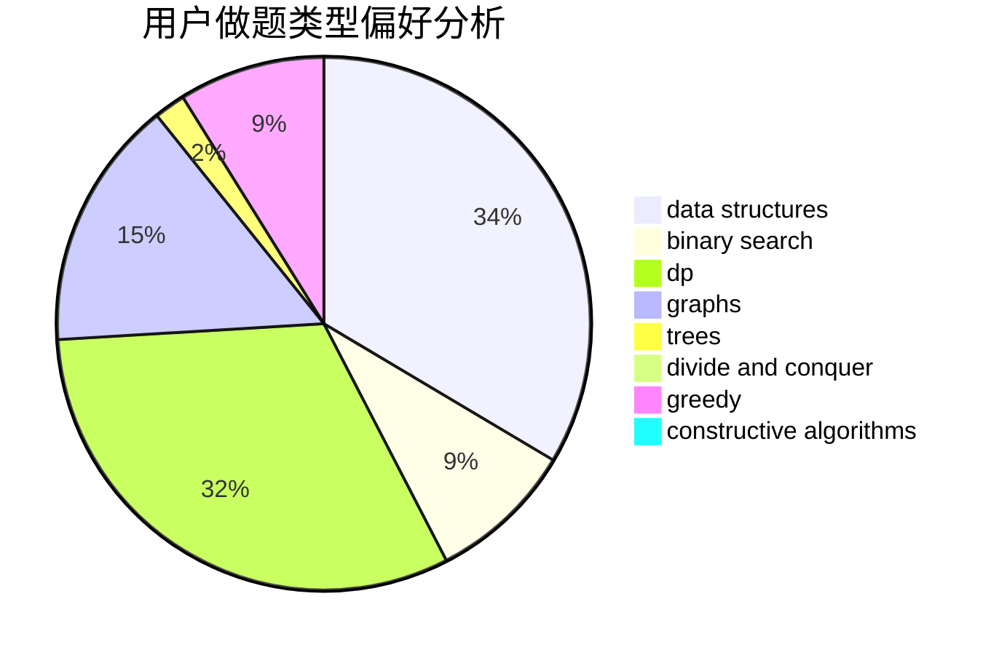
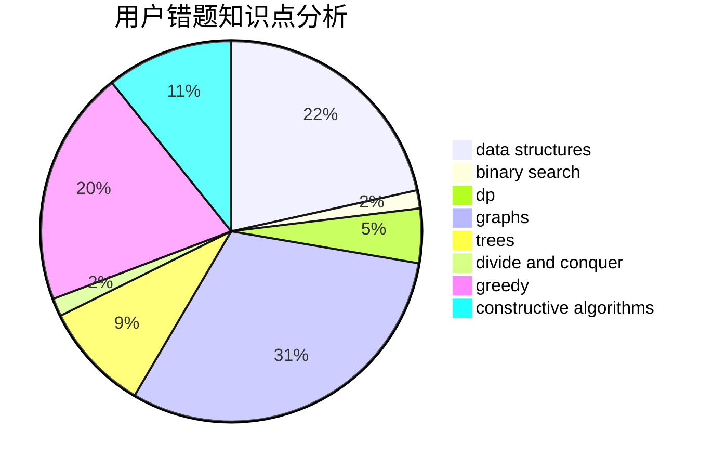

# ygy

<!-- tabs:start -->

#### **用户提交结果分析**

#### **用户做题类型偏好分析**

#### **用户错题知识点分析**

<!-- tabs:end -->
# 推荐题目
[559A](https://codeforces.com/contest/559/problem/A)		brute force,
                        geometry,
                        math		  
[371C](https://codeforces.com/contest/371/problem/C)		binary search,
                        brute force		  
[1333D](https://codeforces.com/contest/1333/problem/D)		brute force,
                        constructive algorithms,
                        games,
                        graphs,
                        greedy,
                        implementation,
                        sortings		  
[1005A](https://codeforces.com/contest/1005/problem/A)		implementation		  
[268B](https://codeforces.com/contest/268/problem/B)		implementation,
                        math		  
[13B](https://codeforces.com/contest/13/problem/B)		geometry,
                        implementation		  
[11412](https://codeforces.com/contest/1141/problem/2)		dsu,graphs,sortings,trees		  
[821D](https://codeforces.com/contest/821/problem/D)		dfs and similar,
                        graphs,
                        shortest paths		  
[863D](https://codeforces.com/contest/863/problem/D)		data structures,
                        implementation		  
[1366G](https://codeforces.com/contest/1366/problem/G)		data structures,
                        dp,
                        strings		  
