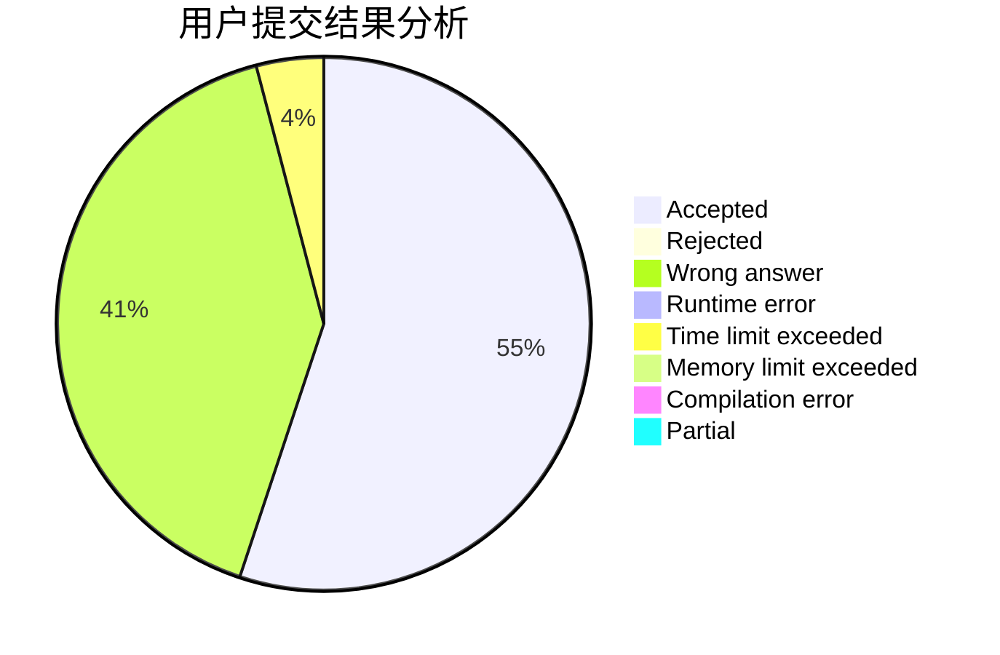
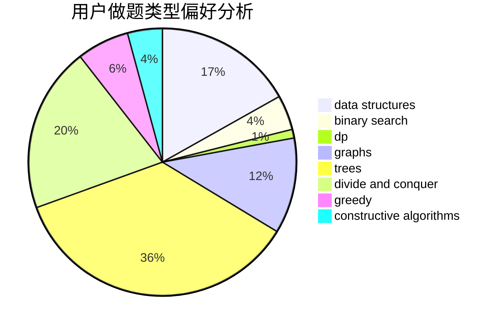
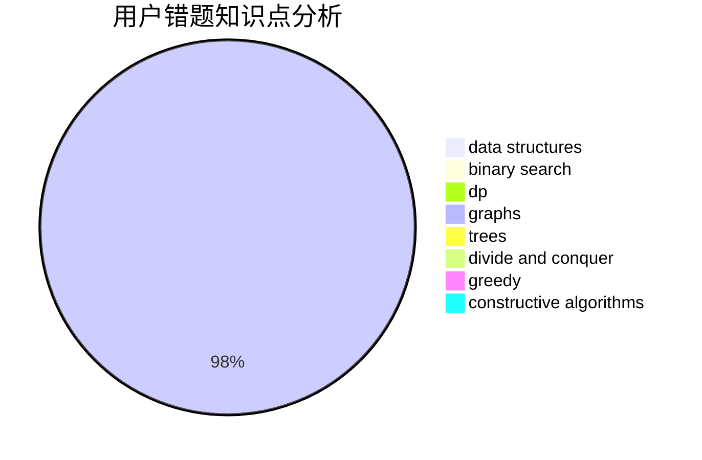

# yhaooo

<!-- tabs:start -->

#### **用户提交结果分析**

#### **用户做题类型偏好分析**

#### **用户错题知识点分析**

<!-- tabs:end -->
# 推荐题目
[543D](https://codeforces.com/contest/543/problem/D)		dp,
                        trees		  
[717A](https://codeforces.com/contest/717/problem/A)		math,
                        number theory		  
[1028D](https://codeforces.com/contest/1028/problem/D)		combinatorics,
                        data structures,
                        greedy		  
[1367F2](https://codeforces.com/contest/1367F/problem/2)		binary search,
                        data structures,
                        dp,
                        greedy,
                        sortings,
                        two pointers		  
[319B](https://codeforces.com/contest/319/problem/B)		data structures,
                        implementation		  
[513B2](https://codeforces.com/contest/513B/problem/2)		bitmasks,
                        divide and conquer,
                        math		  
[1225F](https://codeforces.com/contest/1225/problem/F)		constructive algorithms,
                        greedy,
                        trees		  
[1464C](https://codeforces.com/contest/1464/problem/C)		dsu,graphs,sortings,trees		  
[917B](https://codeforces.com/contest/917/problem/B)		dfs and similar,
                        dp,
                        games,
                        graphs		  
[1433B](https://codeforces.com/contest/1433/problem/B)		greedy,
                        implementation		  
