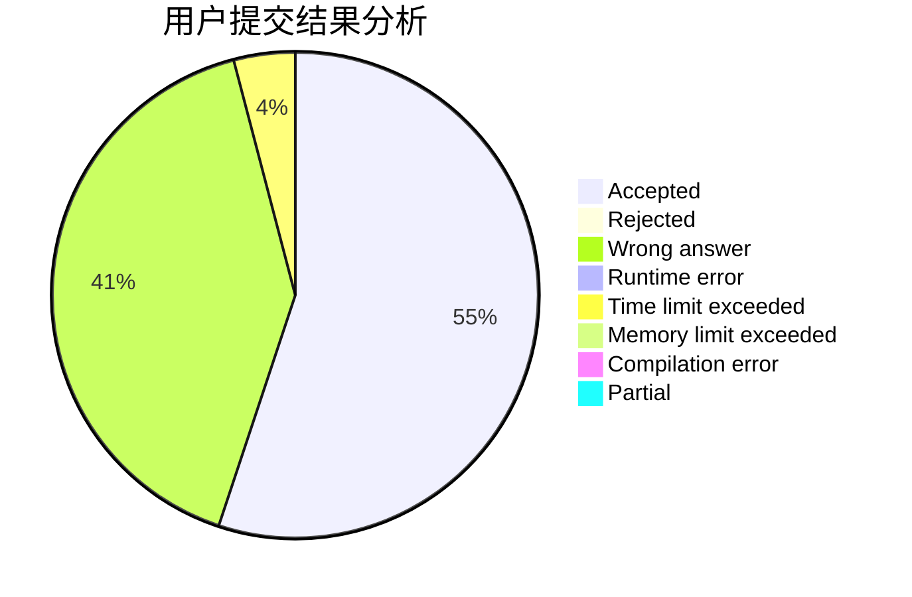
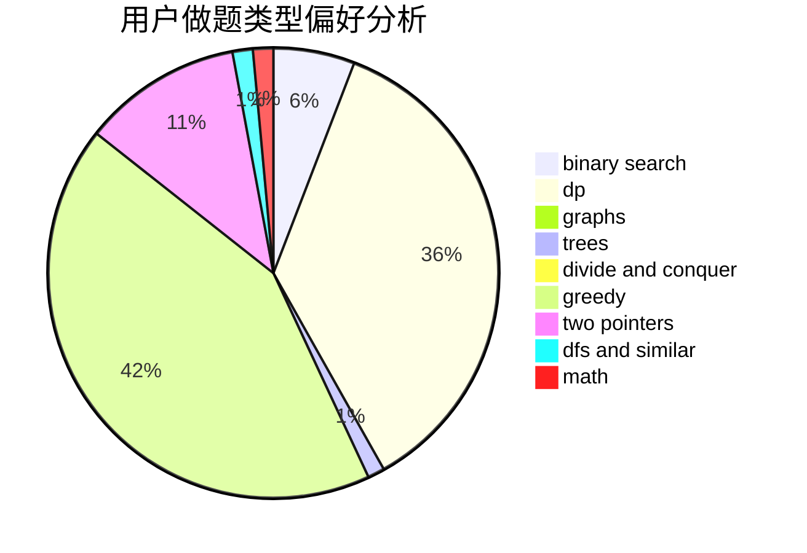

# yhaooo

<!-- tabs:start -->

#### **用户提交结果分析**

#### **用户做题类型偏好分析**

<!-- tabs:end -->
# 推荐题目
[567F](https://codeforces.com/contest/567/problem/F)
[734D](https://codeforces.com/contest/734/problem/D)
[1028H](https://codeforces.com/contest/1028/problem/H)
[1374D](https://codeforces.com/contest/1374/problem/D)
[34A](https://codeforces.com/contest/34/problem/A)
[538B](https://codeforces.com/contest/538/problem/B)
[1234C](https://codeforces.com/contest/1234/problem/C)
[1471D](https://codeforces.com/contest/1471/problem/D)
[937C](https://codeforces.com/contest/937/problem/C)
[1443A](https://codeforces.com/contest/1443/problem/A)
