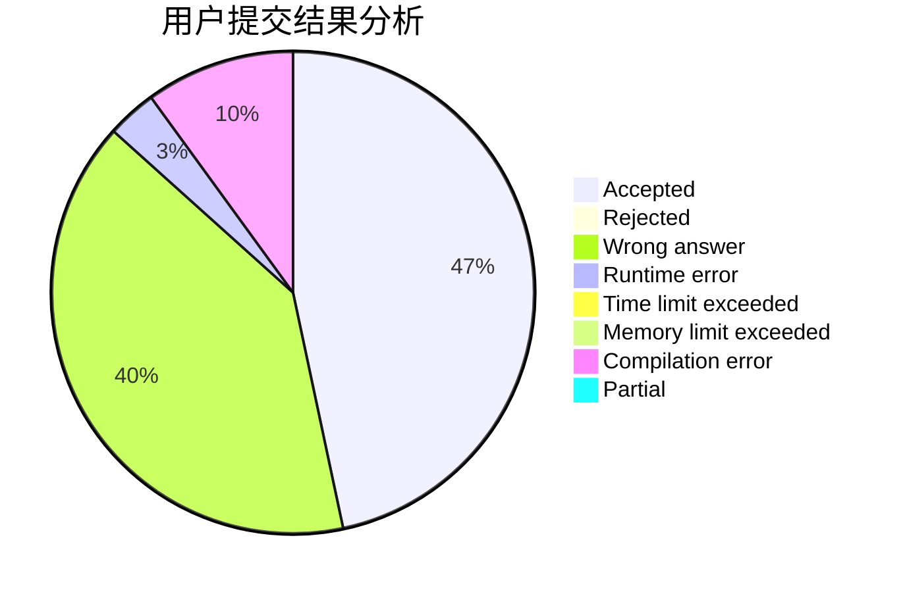
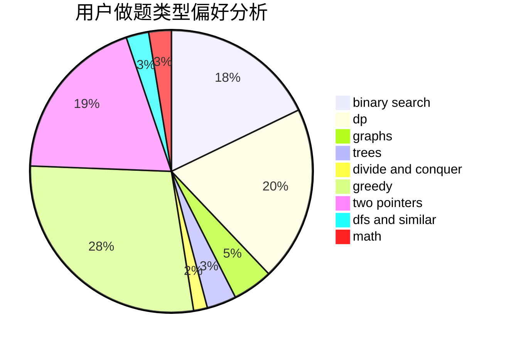

# yhf_2017

<!-- tabs:start -->

#### **用户提交结果分析**

#### **用户做题类型偏好分析**

<!-- tabs:end -->
# 推荐题目
[746G](https://codeforces.com/contest/746/problem/G)
[234A](https://codeforces.com/contest/234/problem/A)
[652D](https://codeforces.com/contest/652/problem/D)
[189E](https://codeforces.com/contest/189/problem/E)
[1008C](https://codeforces.com/contest/1008/problem/C)
[1157G](https://codeforces.com/contest/1157/problem/G)
[1162C](https://codeforces.com/contest/1162/problem/C)
[1360E](https://codeforces.com/contest/1360/problem/E)
[715A](https://codeforces.com/contest/715/problem/A)
[1340D](https://codeforces.com/contest/1340/problem/D)
