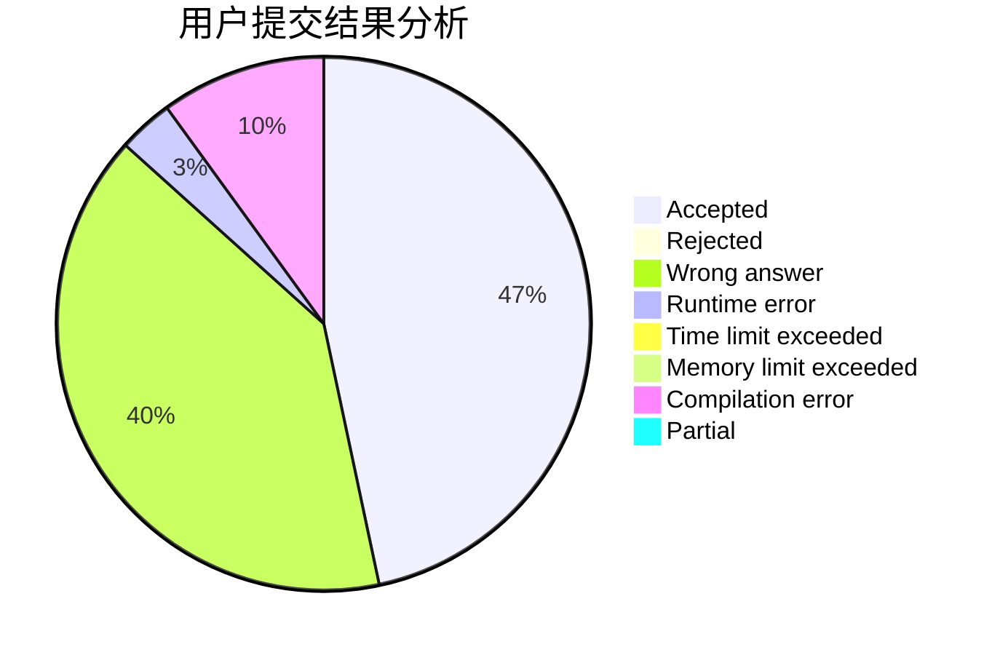
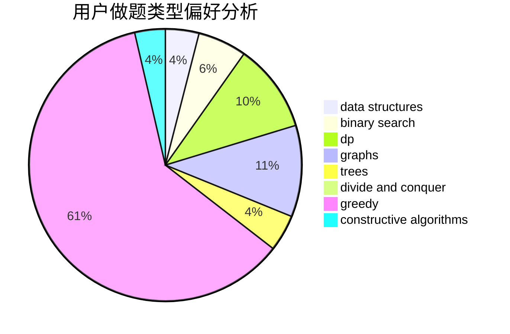
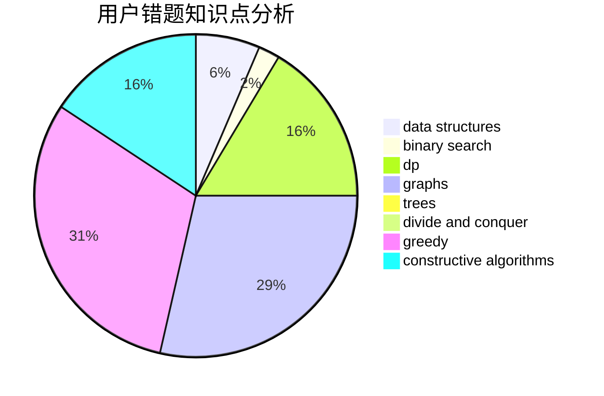

# yhf_2017

<!-- tabs:start -->

#### **用户提交结果分析**

#### **用户做题类型偏好分析**

#### **用户错题知识点分析**

<!-- tabs:end -->
# 推荐题目
[730A](https://codeforces.com/contest/730/problem/A)		greedy,
                        implementation		  
[215B](https://codeforces.com/contest/215/problem/B)		greedy,
                        math		  
[625E](https://codeforces.com/contest/625/problem/E)		data structures,
                        greedy		  
[163E](https://codeforces.com/contest/163/problem/E)		data structures,
                        dfs and similar,
                        dp,
                        strings,
                        trees		  
[1007E](https://codeforces.com/contest/1007/problem/E)		dp		  
[1156B](https://codeforces.com/contest/1156/problem/B)		dfs and similar,
                        greedy,
                        implementation,
                        sortings,
                        strings		  
[1159D](https://codeforces.com/contest/1159/problem/D)		dsu,graphs,sortings,trees		  
[1354A](https://codeforces.com/contest/1354/problem/A)		math		  
[698C](https://codeforces.com/contest/698/problem/C)		bitmasks,
                        dp,
                        math,
                        probabilities		  
[1333E](https://codeforces.com/contest/1333/problem/E)		brute force,
                        constructive algorithms		  
