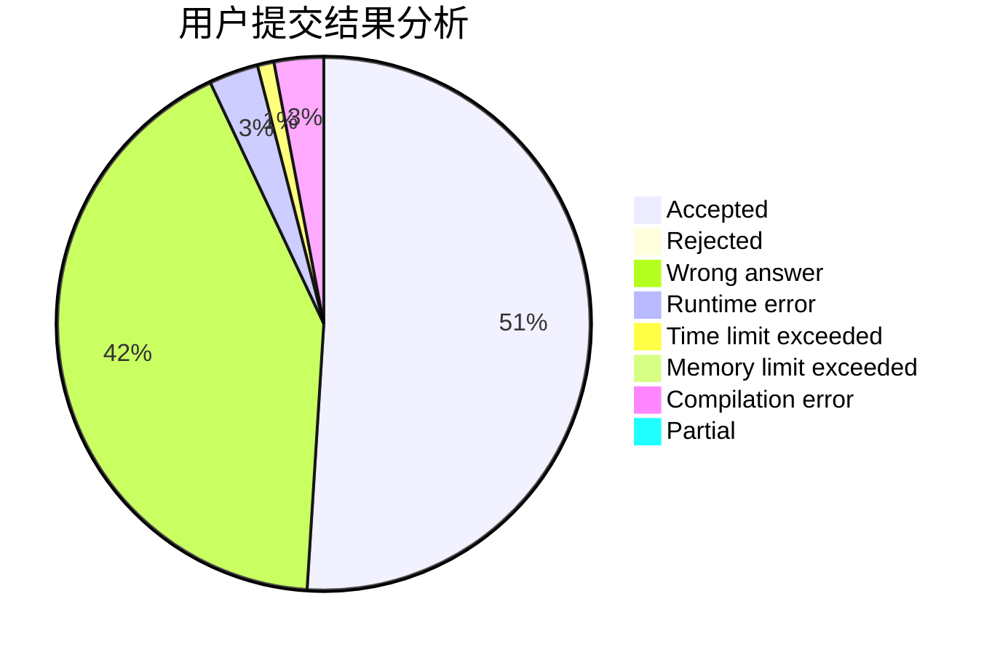
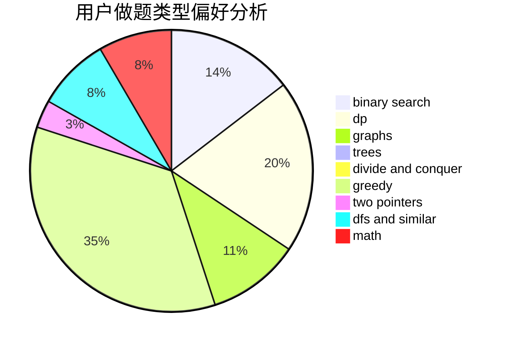

# yhx-12243

<!-- tabs:start -->

#### **用户提交结果分析**

#### **用户做题类型偏好分析**

<!-- tabs:end -->
# 推荐题目
[76C](https://codeforces.com/contest/76/problem/C)
[717E](https://codeforces.com/contest/717/problem/E)
[866D](https://codeforces.com/contest/866/problem/D)
[482E](https://codeforces.com/contest/482/problem/E)
[35C](https://codeforces.com/contest/35/problem/C)
[1165B](https://codeforces.com/contest/1165/problem/B)
[309B](https://codeforces.com/contest/309/problem/B)
[263E](https://codeforces.com/contest/263/problem/E)
[463B](https://codeforces.com/contest/463/problem/B)
[962F](https://codeforces.com/contest/962/problem/F)
