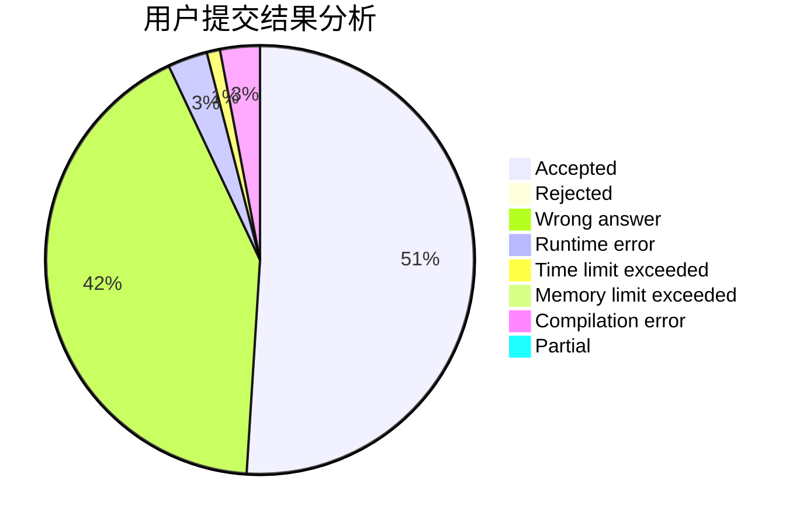
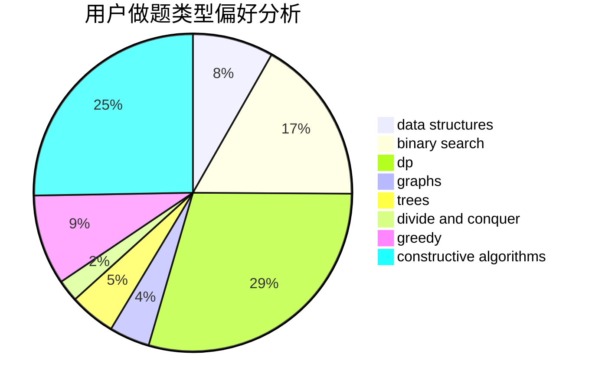
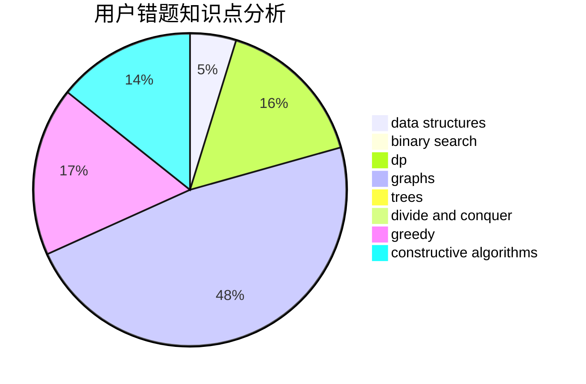

# yhx-12243

<!-- tabs:start -->

#### **用户提交结果分析**

#### **用户做题类型偏好分析**

#### **用户错题知识点分析**

<!-- tabs:end -->
# 推荐题目
[750C](https://codeforces.com/contest/750/problem/C)		binary search,
                        greedy,
                        math		  
[6C](https://codeforces.com/contest/6/problem/C)		greedy,
                        two pointers		  
[848A](https://codeforces.com/contest/848/problem/A)		constructive algorithms		  
[463A](https://codeforces.com/contest/463/problem/A)		brute force,
                        implementation		  
[331E2](https://codeforces.com/contest/331E/problem/2)		constructive algorithms,
                        dp		  
[1163F](https://codeforces.com/contest/1163/problem/F)		data structures,
                        graphs,
                        shortest paths		  
[292E](https://codeforces.com/contest/292/problem/E)		data structures		  
[242E](https://codeforces.com/contest/242/problem/E)		bitmasks,
                        data structures		  
[442D](https://codeforces.com/contest/442/problem/D)		data structures,
                        trees		  
[946B](https://codeforces.com/contest/946/problem/B)		math,
                        number theory		  
