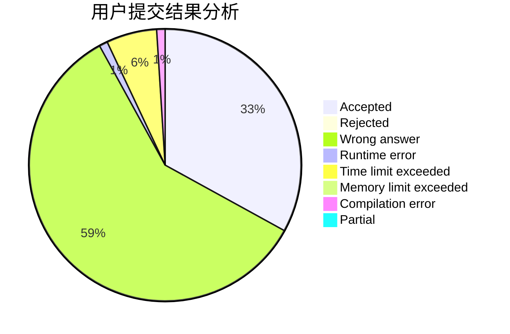
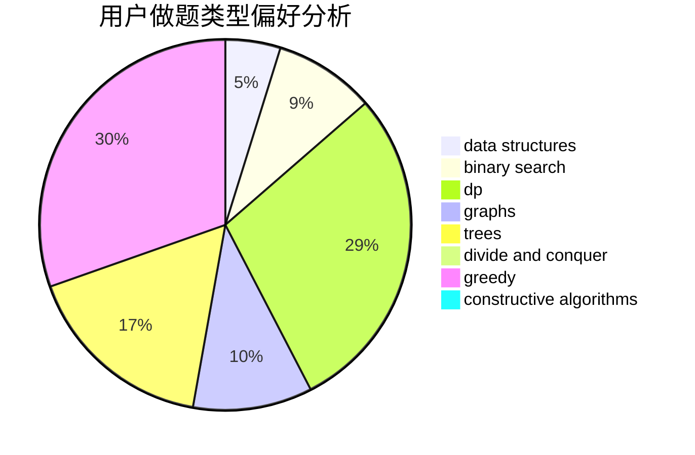
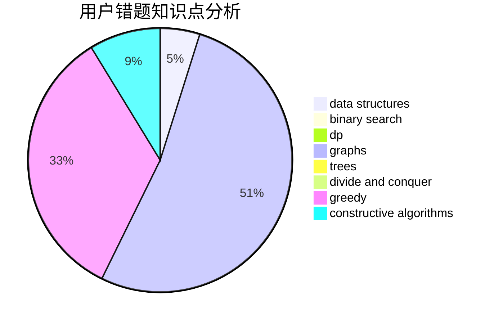

# yijan

<!-- tabs:start -->

#### **用户提交结果分析**

#### **用户做题类型偏好分析**

#### **用户错题知识点分析**

<!-- tabs:end -->
# 推荐题目
[940E](https://codeforces.com/contest/940/problem/E)		data structures,
                        dp,
                        greedy,
                        math		  
[246C](https://codeforces.com/contest/246/problem/C)		brute force,
                        constructive algorithms,
                        greedy		  
[1267C](https://codeforces.com/contest/1267/problem/C)		constructive algorithms		  
[1205F](https://codeforces.com/contest/1205/problem/F)		constructive algorithms,
                        math		  
[1108B](https://codeforces.com/contest/1108/problem/B)		brute force,
                        greedy,
                        math,
                        number theory		  
[471D](https://codeforces.com/contest/471/problem/D)		string suffix structures,
                        strings		  
[1456E](https://codeforces.com/contest/1456/problem/E)		dp,
                        greedy		  
[1418D](https://codeforces.com/contest/1418/problem/D)		data structures,
                        implementation		  
[235D](https://codeforces.com/contest/235/problem/D)		graphs		  
[286C](https://codeforces.com/contest/286/problem/C)		greedy,
                        implementation		  
