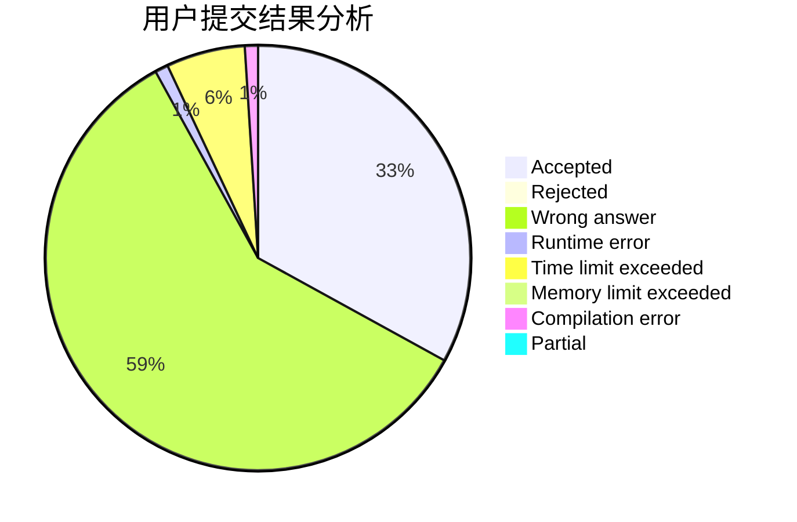
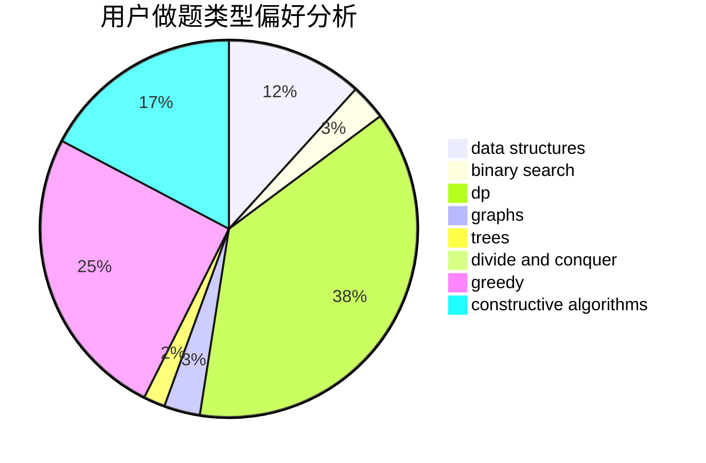
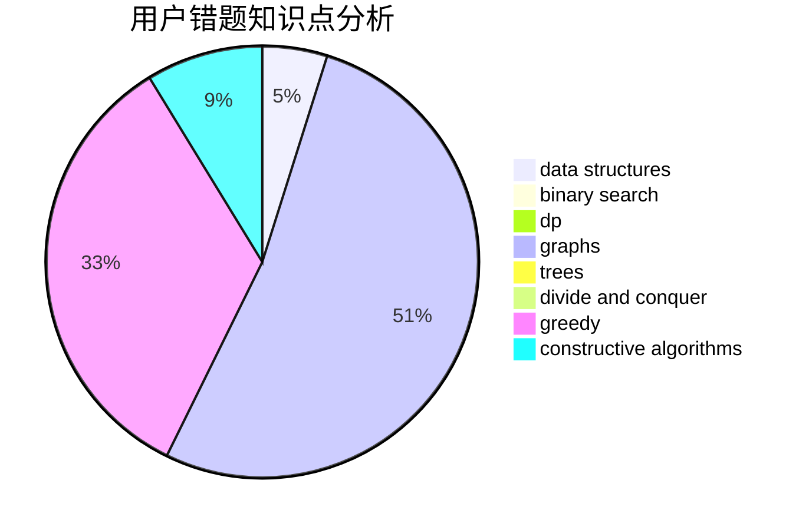

# yijan

<!-- tabs:start -->

#### **用户提交结果分析**

#### **用户做题类型偏好分析**

#### **用户错题知识点分析**

<!-- tabs:end -->
# 推荐题目
[962B](https://codeforces.com/contest/962/problem/B)		constructive algorithms,
                        greedy,
                        implementation		  
[266E](https://codeforces.com/contest/266/problem/E)		data structures,
                        math		  
[1272F](https://codeforces.com/contest/1272/problem/F)		dp,
                        strings,
                        two pointers		  
[120J](https://codeforces.com/contest/120/problem/J)		divide and conquer,
                        geometry,
                        sortings		  
[1108C](https://codeforces.com/contest/1108/problem/C)		brute force,
                        greedy,
                        math		  
[490A](https://codeforces.com/contest/490/problem/A)		greedy,
                        implementation,
                        sortings		  
[1466C](https://codeforces.com/contest/1466/problem/C)		dp,
                        greedy,
                        strings		  
[1426A](https://codeforces.com/contest/1426/problem/A)		implementation,
                        math		  
[258C](https://codeforces.com/contest/258/problem/C)		binary search,
                        combinatorics,
                        dp,
                        math		  
[300D](https://codeforces.com/contest/300/problem/D)		dp,
                        fft		  
