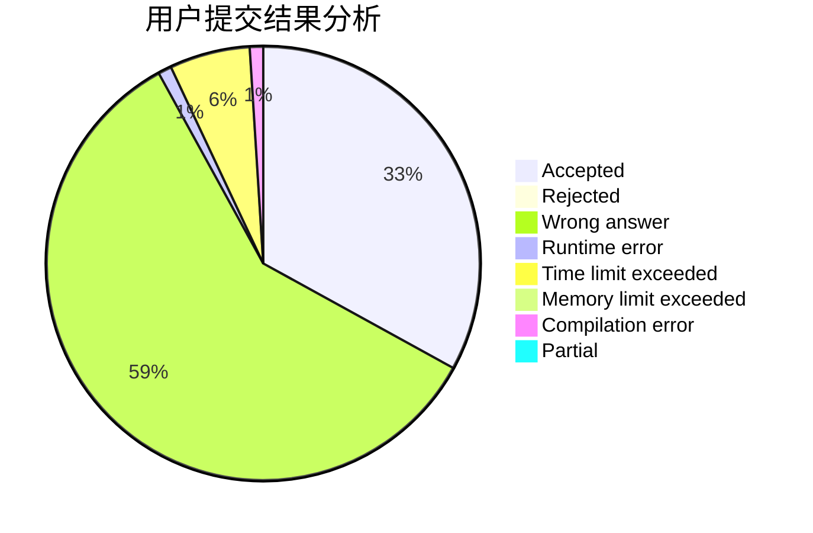
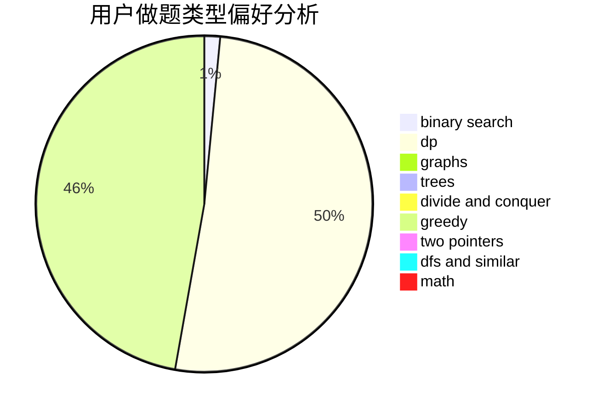

# yijan

<!-- tabs:start -->

#### **用户提交结果分析**

#### **用户做题类型偏好分析**

<!-- tabs:end -->
# 推荐题目
[962B](https://codeforces.com/contest/962/problem/B)
[266E](https://codeforces.com/contest/266/problem/E)
[1272F](https://codeforces.com/contest/1272/problem/F)
[120J](https://codeforces.com/contest/120/problem/J)
[1108C](https://codeforces.com/contest/1108/problem/C)
[490A](https://codeforces.com/contest/490/problem/A)
[1466C](https://codeforces.com/contest/1466/problem/C)
[1426A](https://codeforces.com/contest/1426/problem/A)
[258C](https://codeforces.com/contest/258/problem/C)
[300D](https://codeforces.com/contest/300/problem/D)
