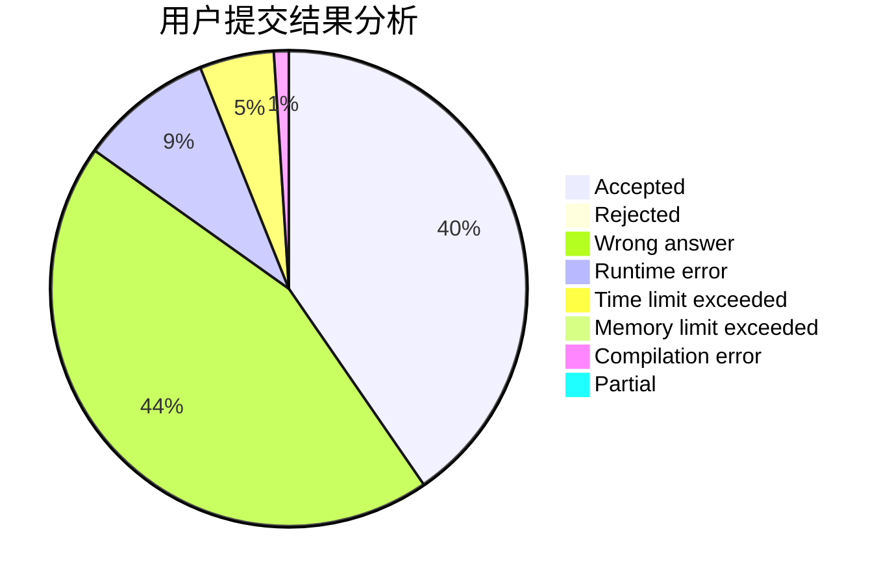
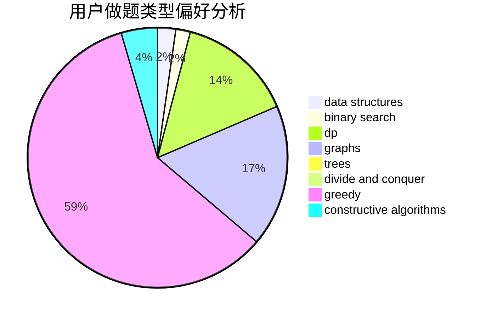
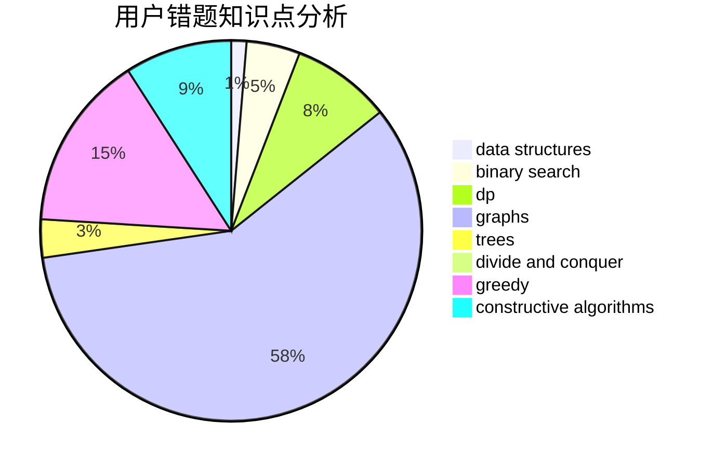

# yikanji

<!-- tabs:start -->

#### **用户提交结果分析**

#### **用户做题类型偏好分析**

#### **用户错题知识点分析**

<!-- tabs:end -->
# 推荐题目
[300E](https://codeforces.com/contest/300/problem/E)		binary search,
                        math,
                        number theory		  
[909F](https://codeforces.com/contest/909/problem/F)		constructive algorithms		  
[1464E](https://codeforces.com/contest/1464/problem/E)		dsu,graphs,sortings,trees		  
[1270H](https://codeforces.com/contest/1270/problem/H)		data structures		  
[274A](https://codeforces.com/contest/274/problem/A)		binary search,
                        greedy,
                        sortings		  
[525D](https://codeforces.com/contest/525/problem/D)		constructive algorithms,
                        data structures,
                        graphs,
                        greedy,
                        shortest paths		  
[573C](https://codeforces.com/contest/573/problem/C)		constructive algorithms,
                        dfs and similar,
                        trees		  
[1404D](https://codeforces.com/contest/1404/problem/D)		constructive algorithms,
                        dfs and similar,
                        interactive,
                        math,
                        number theory		  
[1400C](https://codeforces.com/contest/1400/problem/C)		2-sat,
                        brute force,
                        constructive algorithms,
                        greedy		  
[41E](https://codeforces.com/contest/41/problem/E)		constructive algorithms,
                        graphs,
                        greedy		  
