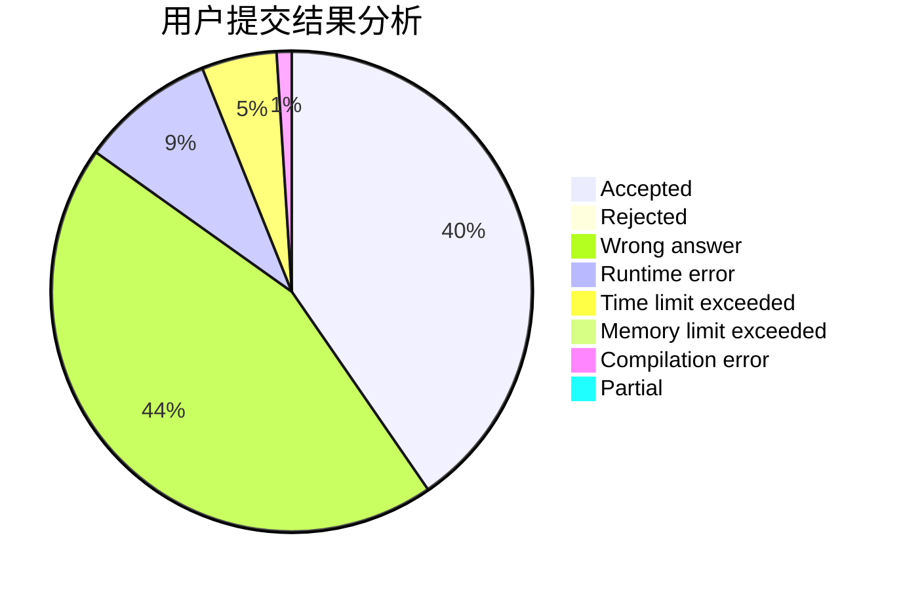
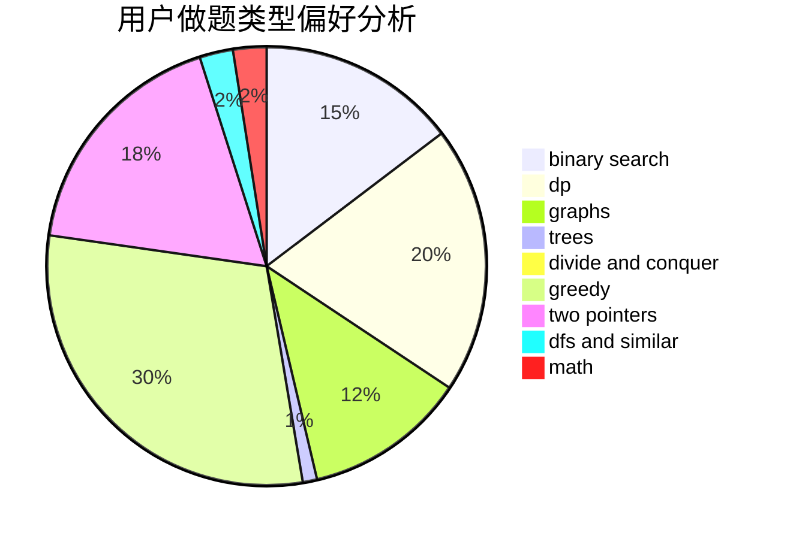

# yikanji

<!-- tabs:start -->

#### **用户提交结果分析**

#### **用户做题类型偏好分析**

<!-- tabs:end -->
# 推荐题目
[319C](https://codeforces.com/contest/319/problem/C)
[924D](https://codeforces.com/contest/924/problem/D)
[1471F](https://codeforces.com/contest/1471/problem/F)
[1280A](https://codeforces.com/contest/1280/problem/A)
[289E](https://codeforces.com/contest/289/problem/E)
[54A](https://codeforces.com/contest/54/problem/A)
[593A](https://codeforces.com/contest/593/problem/A)
[1415F](https://codeforces.com/contest/1415/problem/F)
[140B](https://codeforces.com/contest/140/problem/B)
[445C](https://codeforces.com/contest/445/problem/C)
