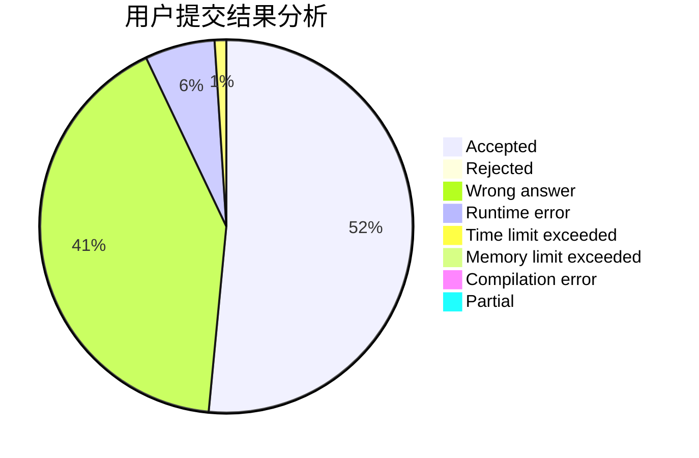
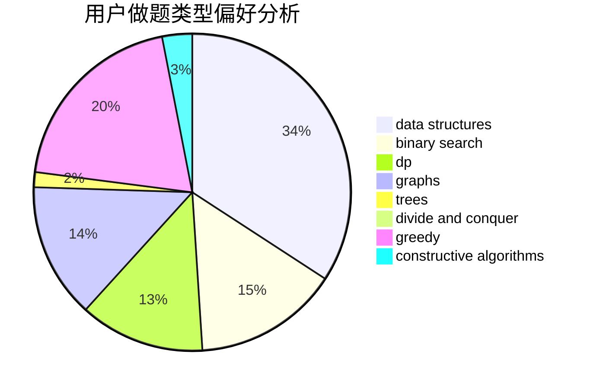
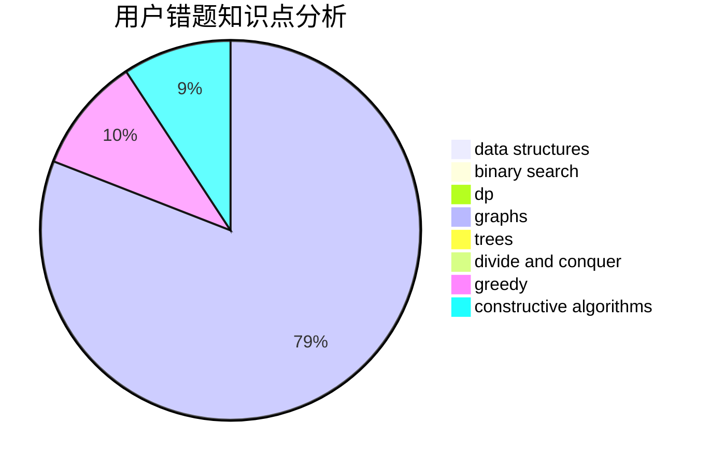

# yinky

<!-- tabs:start -->

#### **用户提交结果分析**

#### **用户做题类型偏好分析**

#### **用户错题知识点分析**

<!-- tabs:end -->
# 推荐题目
[630J](https://codeforces.com/contest/630/problem/J)		math,
                        number theory		  
[1194F](https://codeforces.com/contest/1194/problem/F)		combinatorics,
                        dp,
                        number theory,
                        probabilities,
                        two pointers		  
[551E](https://codeforces.com/contest/551/problem/E)		binary search,
                        data structures,
                        implementation		  
[1144B](https://codeforces.com/contest/1144/problem/B)		greedy,
                        implementation,
                        sortings		  
[1250J](https://codeforces.com/contest/1250/problem/J)		binary search,
                        greedy		  
[420D](https://codeforces.com/contest/420/problem/D)		data structures		  
[226B](https://codeforces.com/contest/226/problem/B)		greedy		  
[762D](https://codeforces.com/contest/762/problem/D)		dp,
                        greedy,
                        implementation		  
[1155D](https://codeforces.com/contest/1155/problem/D)		brute force,
                        data structures,
                        divide and conquer,
                        dp,
                        greedy		  
[1420D](https://codeforces.com/contest/1420/problem/D)		combinatorics,
                        data structures,
                        sortings		  
