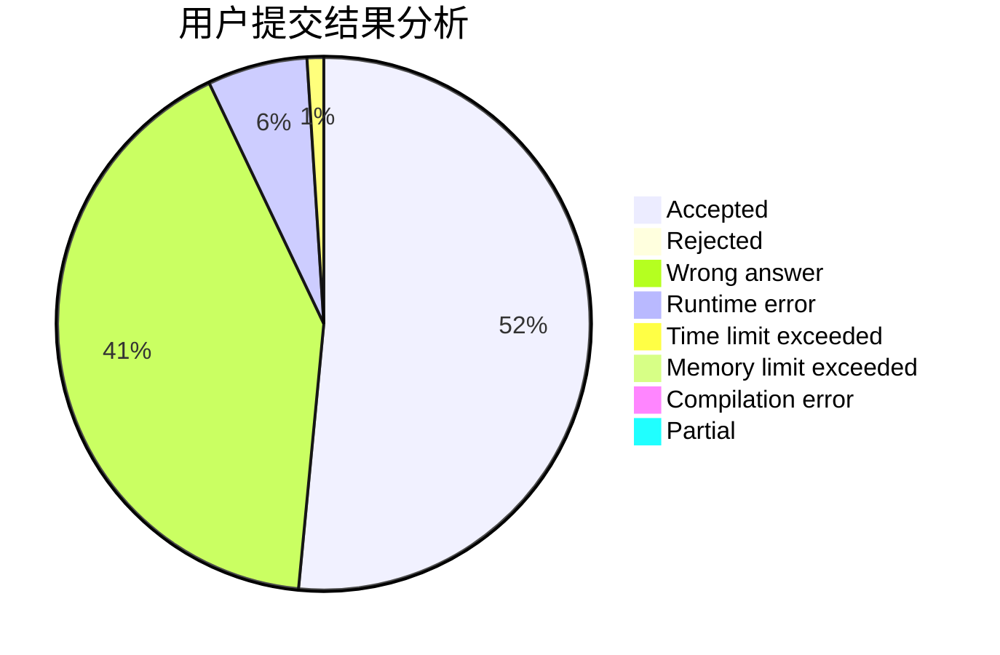
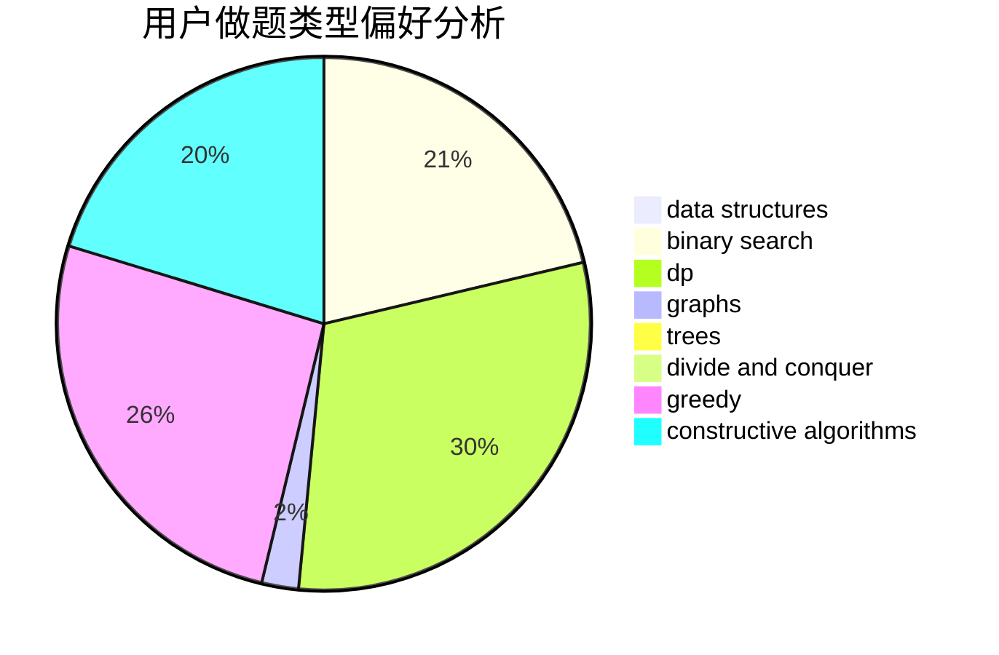
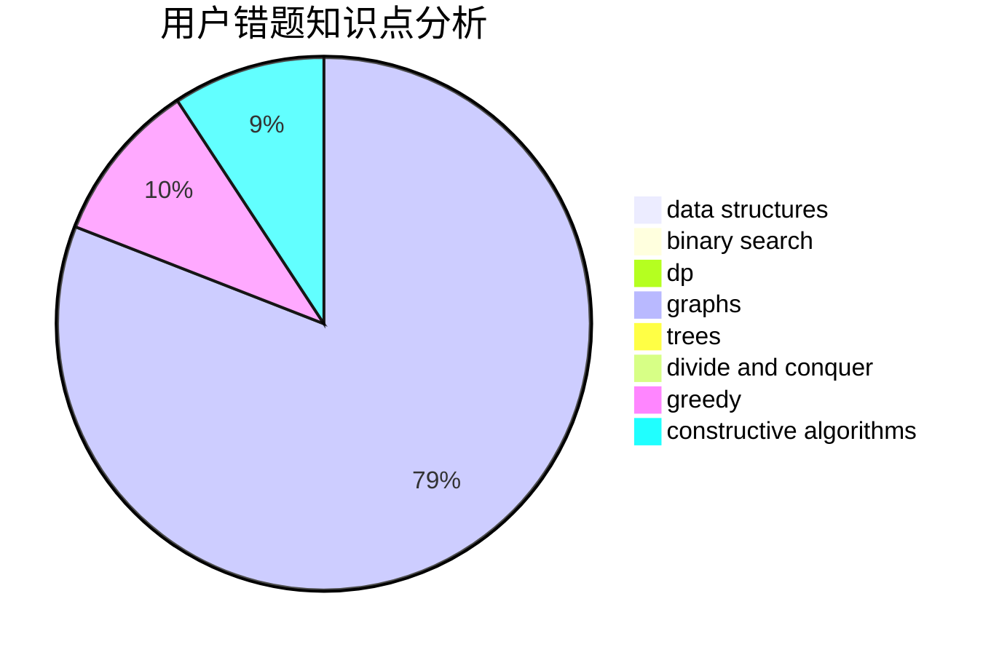

# yinky

<!-- tabs:start -->

#### **用户提交结果分析**

#### **用户做题类型偏好分析**

#### **用户错题知识点分析**

<!-- tabs:end -->
# 推荐题目
[611F](https://codeforces.com/contest/611/problem/F)		binary search,
                        implementation		  
[1189D1](https://codeforces.com/contest/1189D/problem/1)		dsu,graphs,sortings,trees		  
[527E](https://codeforces.com/contest/527/problem/E)		dfs and similar,
                        graphs		  
[1141G](https://codeforces.com/contest/1141/problem/G)		binary search,
                        constructive algorithms,
                        dfs and similar,
                        graphs,
                        greedy,
                        trees		  
[1246B](https://codeforces.com/contest/1246/problem/B)		dsu,graphs,sortings,trees		  
[392A](https://codeforces.com/contest/392/problem/A)		math		  
[201C](https://codeforces.com/contest/201/problem/C)		dp		  
[741D](https://codeforces.com/contest/741/problem/D)		data structures,
                        dfs and similar,
                        trees		  
[1153D](https://codeforces.com/contest/1153/problem/D)		binary search,
                        dfs and similar,
                        dp,
                        greedy,
                        trees		  
[140B](https://codeforces.com/contest/140/problem/B)		brute force,
                        greedy,
                        implementation		  
