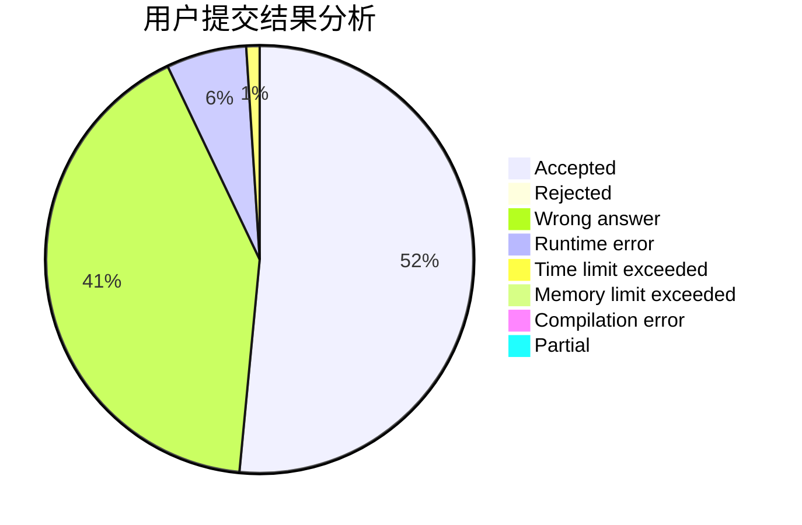
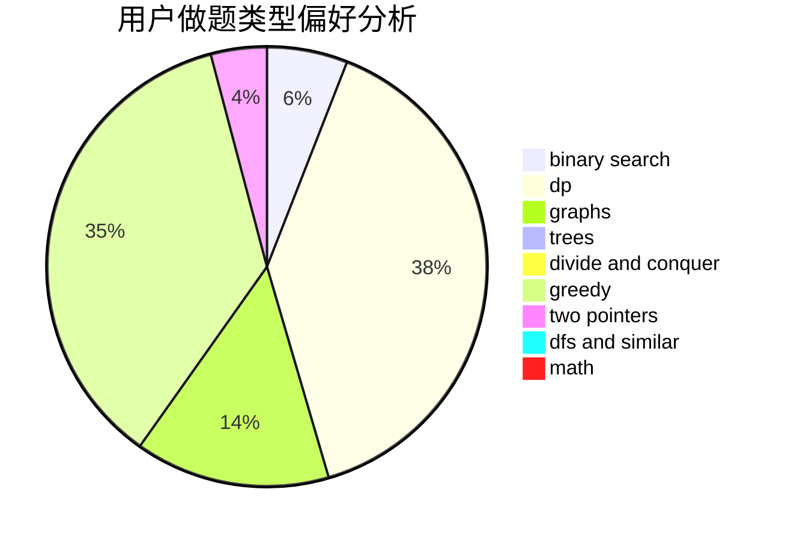

# yinky

<!-- tabs:start -->

#### **用户提交结果分析**

#### **用户做题类型偏好分析**

<!-- tabs:end -->
# 推荐题目
[630J](https://codeforces.com/contest/630/problem/J)
[1194F](https://codeforces.com/contest/1194/problem/F)
[551E](https://codeforces.com/contest/551/problem/E)
[1144B](https://codeforces.com/contest/1144/problem/B)
[1250J](https://codeforces.com/contest/1250/problem/J)
[420D](https://codeforces.com/contest/420/problem/D)
[226B](https://codeforces.com/contest/226/problem/B)
[762D](https://codeforces.com/contest/762/problem/D)
[1155D](https://codeforces.com/contest/1155/problem/D)
[1420D](https://codeforces.com/contest/1420/problem/D)
