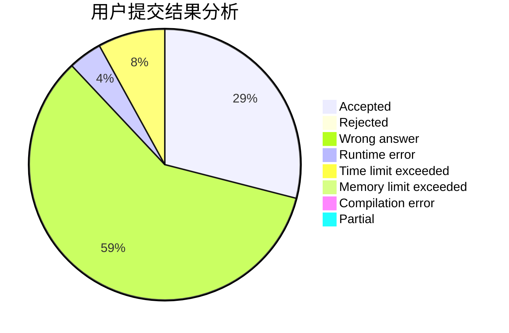
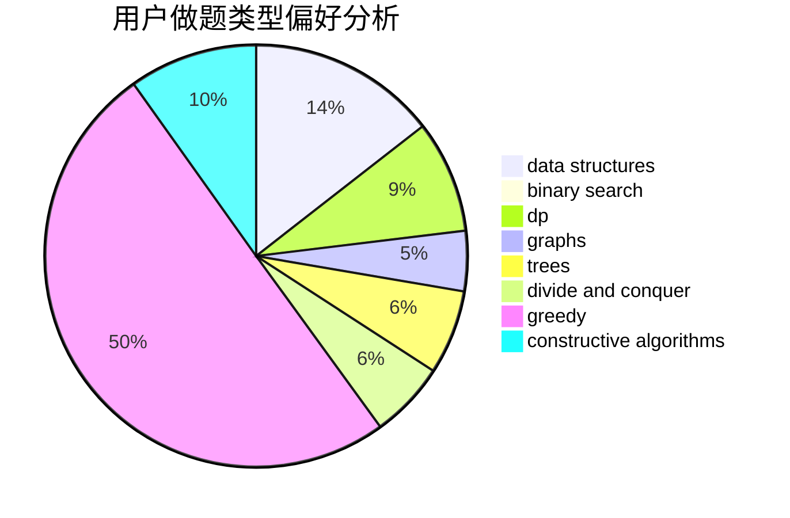
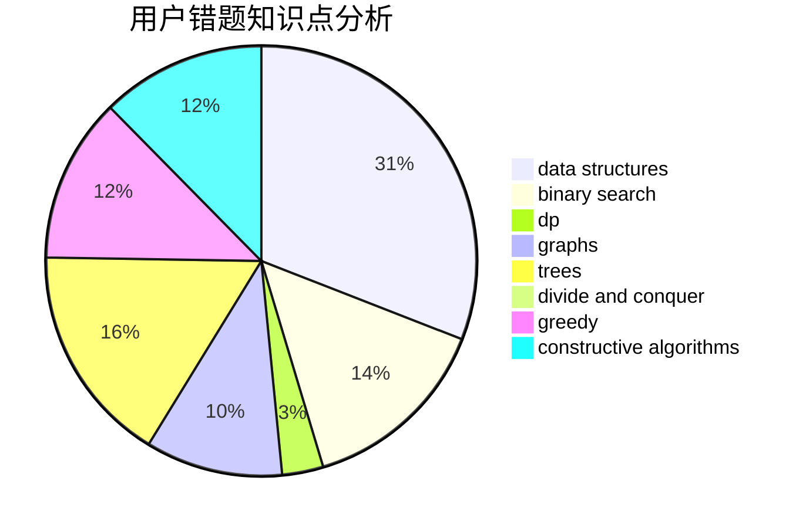

# yinwuxiao

<!-- tabs:start -->

#### **用户提交结果分析**

#### **用户做题类型偏好分析**

#### **用户错题知识点分析**

<!-- tabs:end -->
# 推荐题目
[1106B](https://codeforces.com/contest/1106/problem/B)		data structures,
                        implementation		  
[794G](https://codeforces.com/contest/794/problem/G)		combinatorics,
                        dp,
                        math		  
[1062A](https://codeforces.com/contest/1062/problem/A)		greedy,
                        implementation		  
[1055F](https://codeforces.com/contest/1055/problem/F)		strings,
                        trees		  
[1090A](https://codeforces.com/contest/1090/problem/A)		greedy		  
[1362E](https://codeforces.com/contest/1362/problem/E)		dsu,graphs,sortings,trees		  
[932G](https://codeforces.com/contest/932/problem/G)		dp,
                        string suffix structures,
                        strings		  
[115B](https://codeforces.com/contest/115/problem/B)		greedy,
                        sortings		  
[1479B1](https://codeforces.com/contest/1479B/problem/1)		constructive algorithms,
                        data structures,
                        dp,
                        greedy,
                        implementation		  
[711B](https://codeforces.com/contest/711/problem/B)		constructive algorithms,
                        implementation		  
