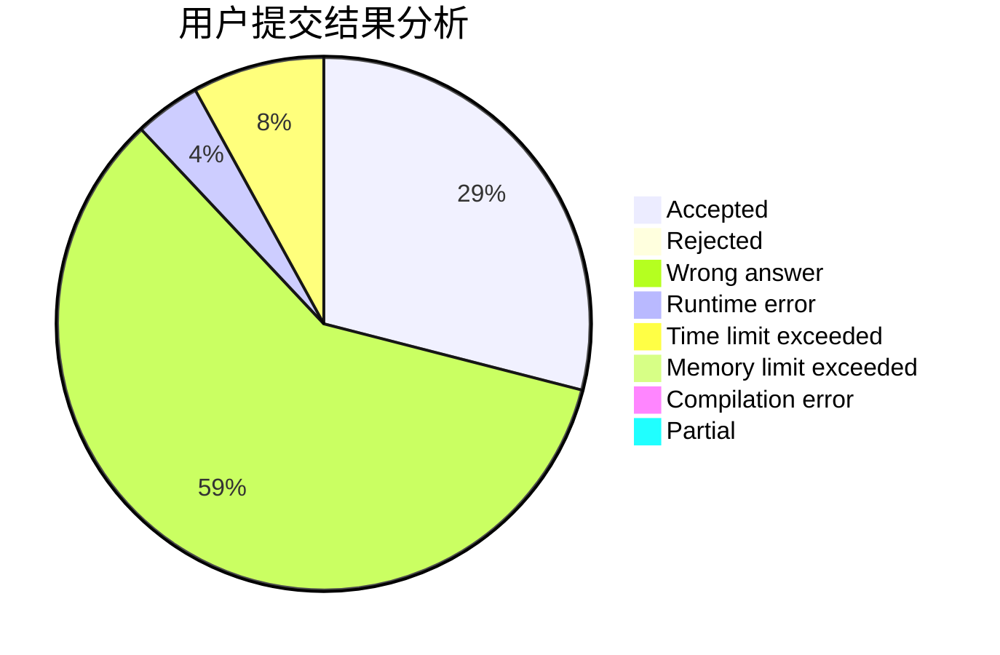
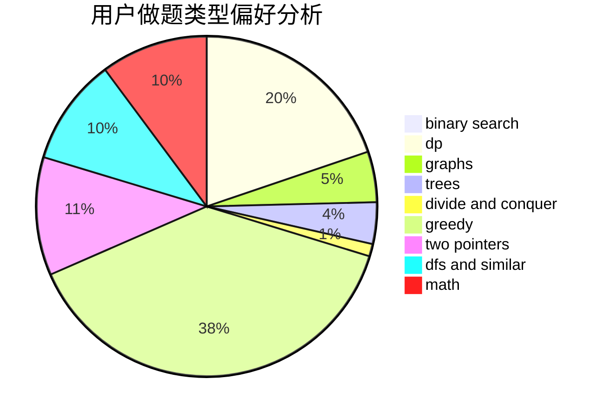

# yinwuxiao

<!-- tabs:start -->

#### **用户提交结果分析**

#### **用户做题类型偏好分析**

<!-- tabs:end -->
# 推荐题目
[1106E](https://codeforces.com/contest/1106/problem/E)
[80A](https://codeforces.com/contest/80/problem/A)
[1062D](https://codeforces.com/contest/1062/problem/D)
[1056C](https://codeforces.com/contest/1056/problem/C)
[1090F](https://codeforces.com/contest/1090/problem/F)
[136D](https://codeforces.com/contest/136/problem/D)
[954I](https://codeforces.com/contest/954/problem/I)
[11631](https://codeforces.com/contest/1163/problem/1)
[1487F](https://codeforces.com/contest/1487/problem/F)
[731B](https://codeforces.com/contest/731/problem/B)
