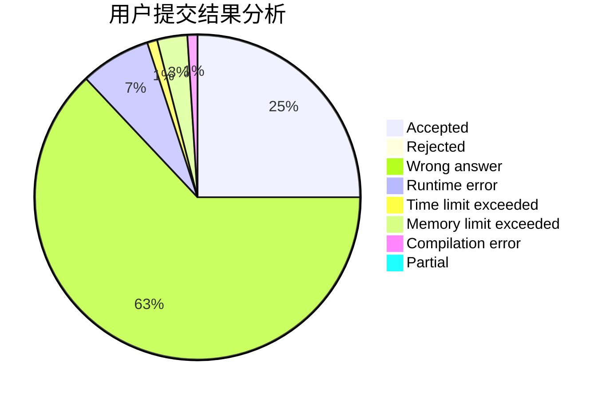
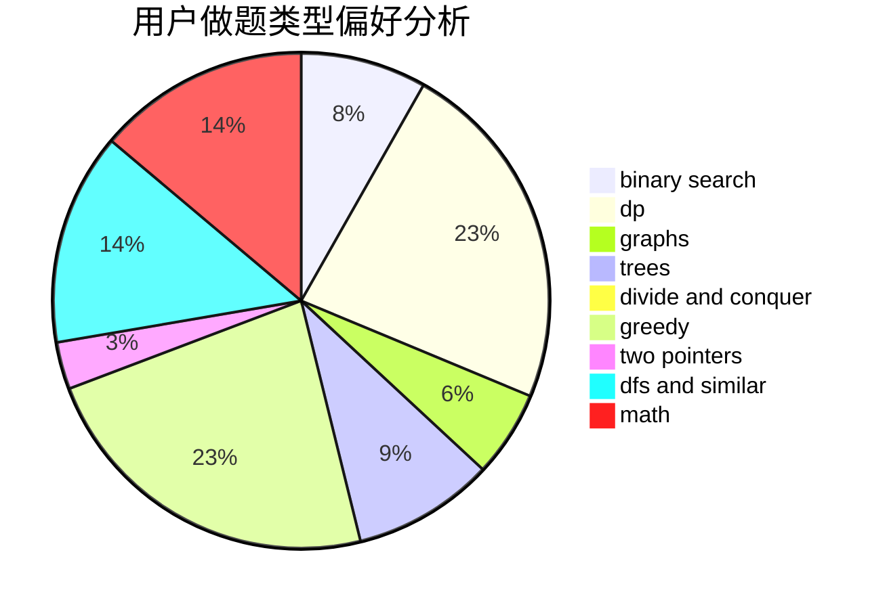

# yiwangzhifeng

<!-- tabs:start -->

#### **用户提交结果分析**

#### **用户做题类型偏好分析**

<!-- tabs:end -->
# 推荐题目
[1000G](https://codeforces.com/contest/1000/problem/G)
[238C](https://codeforces.com/contest/238/problem/C)
[1164P](https://codeforces.com/contest/1164/problem/P)
[1121B](https://codeforces.com/contest/1121/problem/B)
[868B](https://codeforces.com/contest/868/problem/B)
[903A](https://codeforces.com/contest/903/problem/A)
[962C](https://codeforces.com/contest/962/problem/C)
[1147C](https://codeforces.com/contest/1147/problem/C)
[1121A](https://codeforces.com/contest/1121/problem/A)
[915D](https://codeforces.com/contest/915/problem/D)
