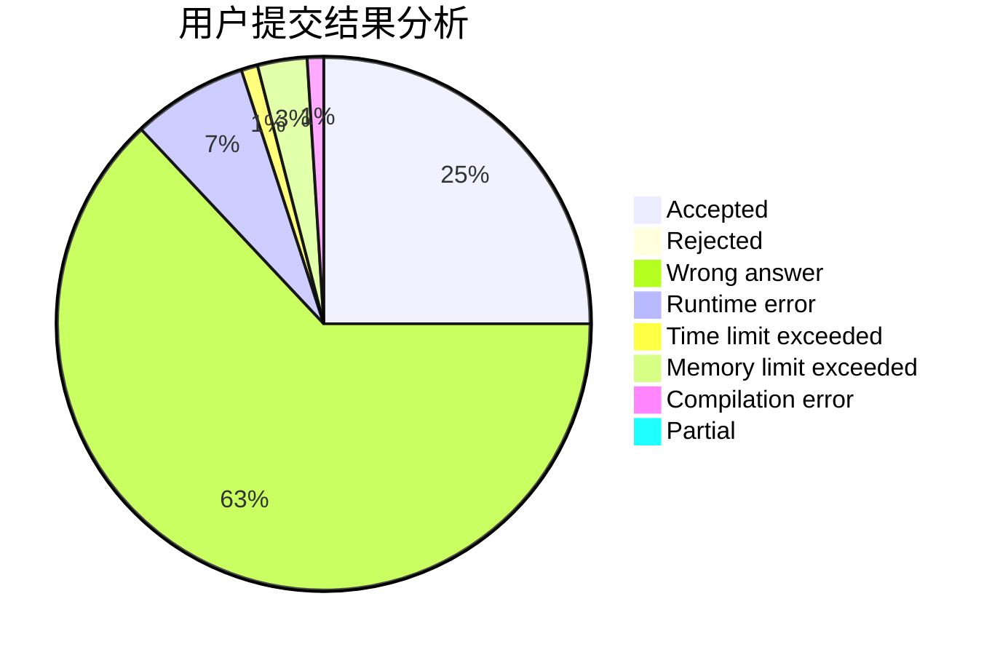
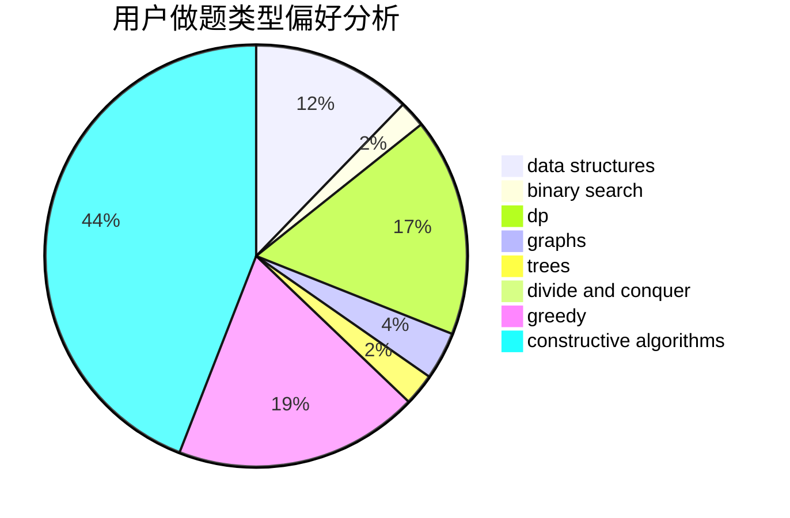
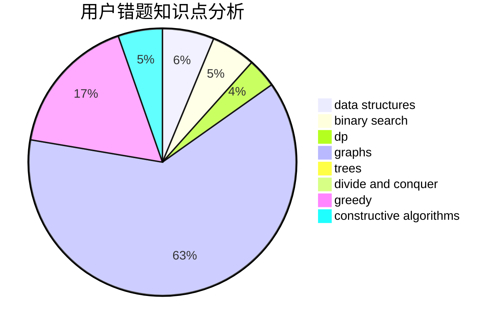

# yiwangzhifeng

<!-- tabs:start -->

#### **用户提交结果分析**

#### **用户做题类型偏好分析**

#### **用户错题知识点分析**

<!-- tabs:end -->
# 推荐题目
[1000G](https://codeforces.com/contest/1000/problem/G)		data structures,
                        dp,
                        trees		  
[238C](https://codeforces.com/contest/238/problem/C)		dfs and similar,
                        dp,
                        greedy,
                        trees		  
[1164P](https://codeforces.com/contest/1164/problem/P)		dsu,graphs,sortings,trees		  
[1121B](https://codeforces.com/contest/1121/problem/B)		brute force,
                        implementation		  
[868B](https://codeforces.com/contest/868/problem/B)		implementation		  
[903A](https://codeforces.com/contest/903/problem/A)		greedy,
                        implementation		  
[962C](https://codeforces.com/contest/962/problem/C)		brute force,
                        implementation,
                        math		  
[1147C](https://codeforces.com/contest/1147/problem/C)		games		  
[1121A](https://codeforces.com/contest/1121/problem/A)		implementation,
                        sortings		  
[915D](https://codeforces.com/contest/915/problem/D)		dfs and similar,
                        graphs		  
