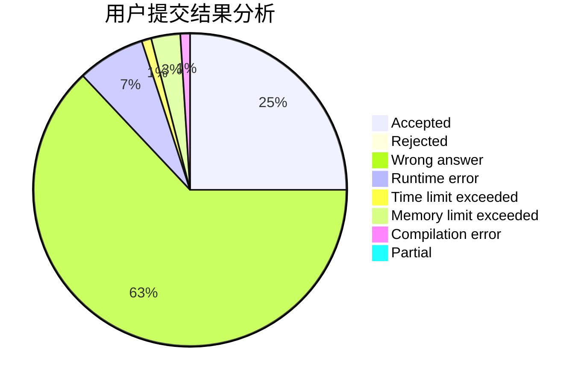
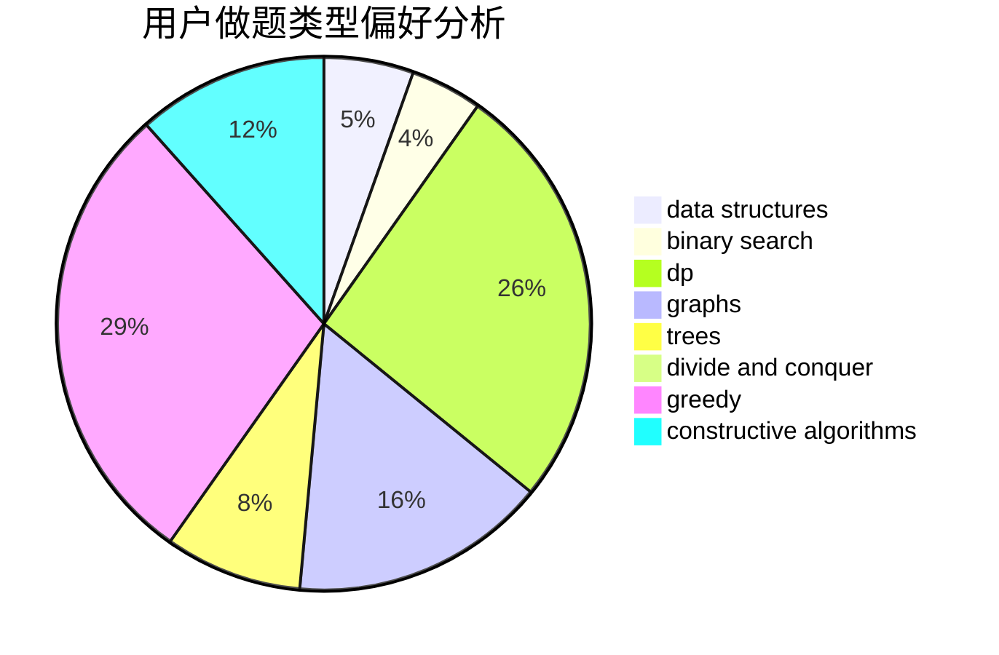
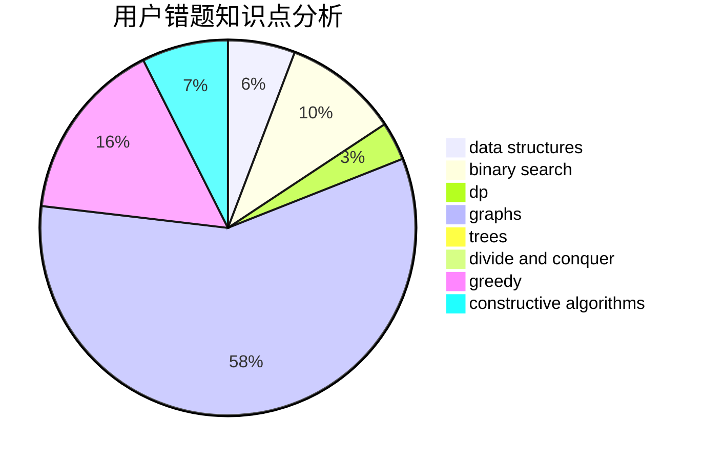

# yiwangzhifeng

<!-- tabs:start -->

#### **用户提交结果分析**

#### **用户做题类型偏好分析**

#### **用户错题知识点分析**

<!-- tabs:end -->
# 推荐题目
[1000G](https://codeforces.com/contest/1000/problem/G)		data structures,
                        dp,
                        trees		  
[219A](https://codeforces.com/contest/219/problem/A)		implementation,
                        strings		  
[1163B1](https://codeforces.com/contest/1163B/problem/1)		data structures,
                        implementation		  
[1119B](https://codeforces.com/contest/1119/problem/B)		binary search,
                        flows,
                        greedy,
                        sortings		  
[848E](https://codeforces.com/contest/848/problem/E)		combinatorics,
                        divide and conquer,
                        dp,
                        fft,
                        math		  
[884D](https://codeforces.com/contest/884/problem/D)		data structures,
                        greedy		  
[940F](https://codeforces.com/contest/940/problem/F)		brute force,
                        data structures		  
[1145B](https://codeforces.com/contest/1145/problem/B)		brute force		  
[1119A](https://codeforces.com/contest/1119/problem/A)		greedy,
                        implementation		  
[899D](https://codeforces.com/contest/899/problem/D)		constructive algorithms,
                        math		  
