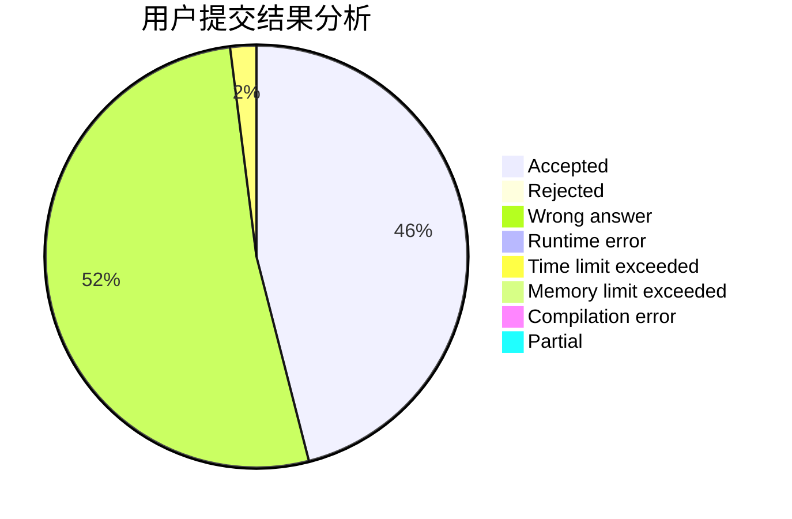
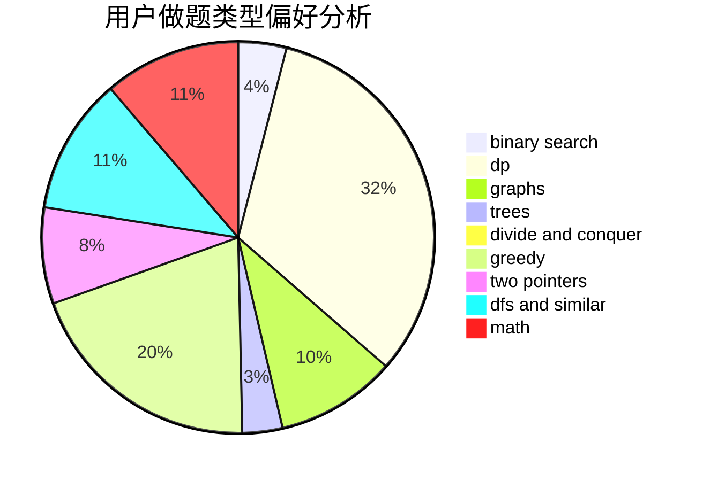

# yizhiyu

<!-- tabs:start -->

#### **用户提交结果分析**

#### **用户做题类型偏好分析**

<!-- tabs:end -->
# 推荐题目
[204E](https://codeforces.com/contest/204/problem/E)
[1009E](https://codeforces.com/contest/1009/problem/E)
[167C](https://codeforces.com/contest/167/problem/C)
[1080B](https://codeforces.com/contest/1080/problem/B)
[118B](https://codeforces.com/contest/118/problem/B)
[901D](https://codeforces.com/contest/901/problem/D)
[1244B](https://codeforces.com/contest/1244/problem/B)
[12481](https://codeforces.com/contest/1248/problem/1)
[452E](https://codeforces.com/contest/452/problem/E)
[700C](https://codeforces.com/contest/700/problem/C)
