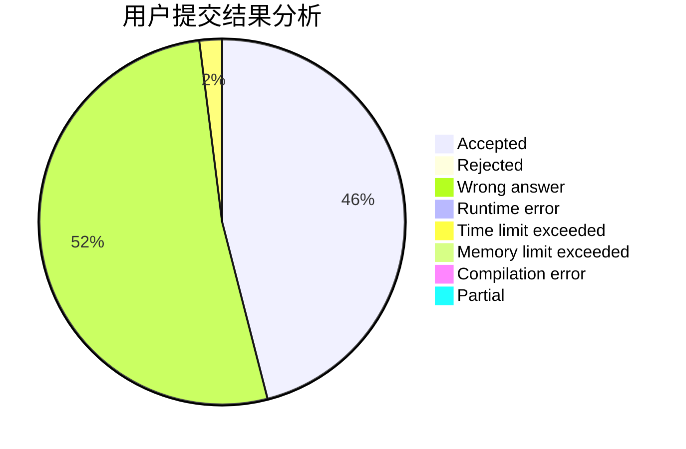
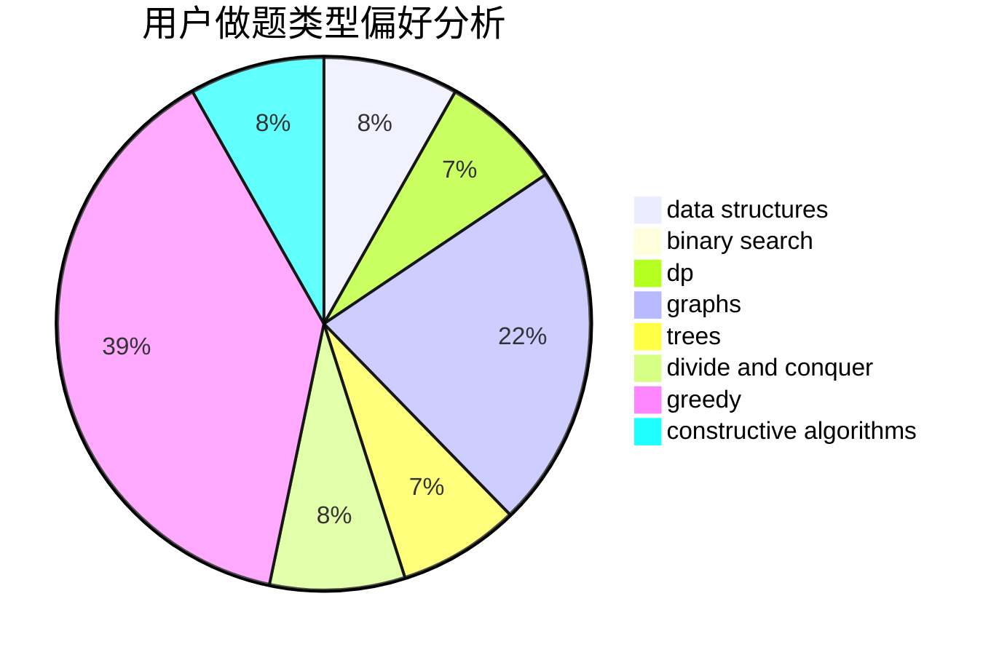
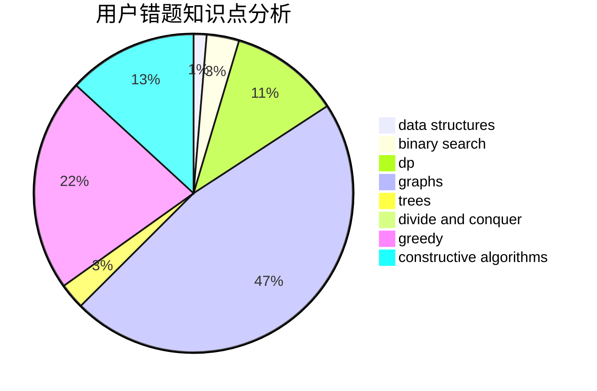

# yizhiyu

<!-- tabs:start -->

#### **用户提交结果分析**

#### **用户做题类型偏好分析**

#### **用户错题知识点分析**

<!-- tabs:end -->
# 推荐题目
[178F2](https://codeforces.com/contest/178F/problem/2)		dp,
                        sortings,
                        strings		  
[1009B](https://codeforces.com/contest/1009/problem/B)		greedy,
                        implementation		  
[1511B](https://codeforces.com/contest/1511/problem/B)		constructive algorithms,
                        math,
                        number theory		  
[107C](https://codeforces.com/contest/107/problem/C)		bitmasks,
                        dp		  
[1185G1](https://codeforces.com/contest/1185G/problem/1)		bitmasks,
                        combinatorics,
                        dp		  
[883K](https://codeforces.com/contest/883/problem/K)		constructive algorithms,
                        greedy,
                        implementation		  
[1238G](https://codeforces.com/contest/1238/problem/G)		data structures,
                        greedy,
                        sortings		  
[1242E](https://codeforces.com/contest/1242/problem/E)		constructive algorithms,
                        graphs		  
[430C](https://codeforces.com/contest/430/problem/C)		dsu,graphs,sortings,trees		  
[676C](https://codeforces.com/contest/676/problem/C)		binary search,
                        dp,
                        strings,
                        two pointers		  
