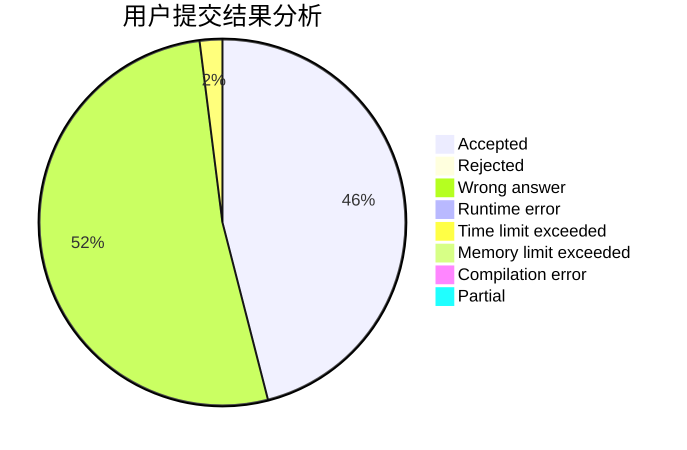
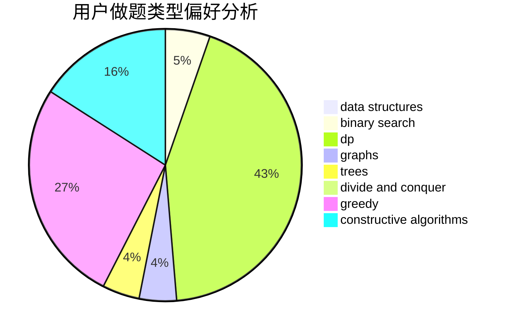
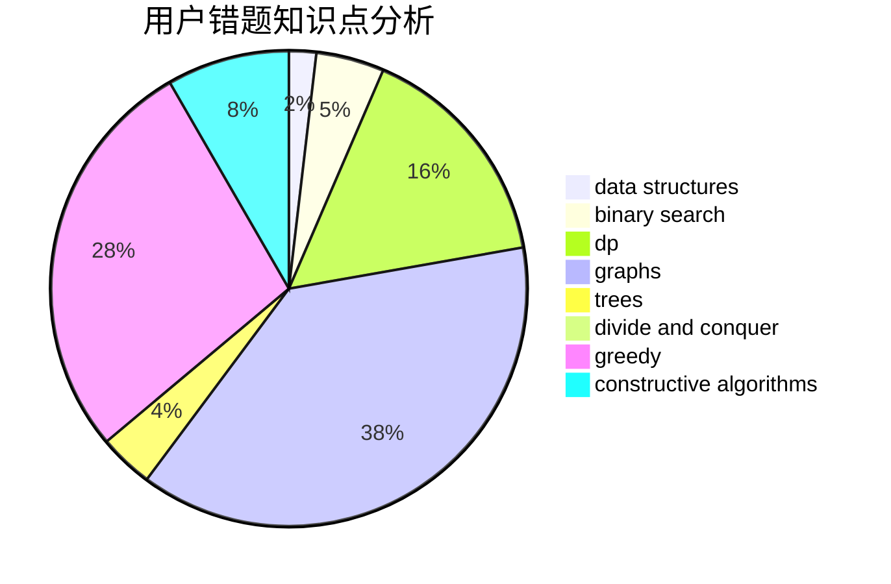

# yizhiyu

<!-- tabs:start -->

#### **用户提交结果分析**

#### **用户做题类型偏好分析**

#### **用户错题知识点分析**

<!-- tabs:end -->
# 推荐题目
[204E](https://codeforces.com/contest/204/problem/E)		data structures,
                        implementation,
                        string suffix structures,
                        two pointers		  
[1009E](https://codeforces.com/contest/1009/problem/E)		combinatorics,
                        math,
                        probabilities		  
[167C](https://codeforces.com/contest/167/problem/C)		games,
                        math		  
[1080B](https://codeforces.com/contest/1080/problem/B)		math		  
[118B](https://codeforces.com/contest/118/problem/B)		constructive algorithms,
                        implementation		  
[901D](https://codeforces.com/contest/901/problem/D)		constructive algorithms,
                        dfs and similar,
                        graphs		  
[1244B](https://codeforces.com/contest/1244/problem/B)		brute force,
                        implementation		  
[12481](https://codeforces.com/contest/1248/problem/1)		dsu,graphs,sortings,trees		  
[452E](https://codeforces.com/contest/452/problem/E)		data structures,
                        dsu,
                        string suffix structures,
                        strings		  
[700C](https://codeforces.com/contest/700/problem/C)		dfs and similar,
                        graphs		  
