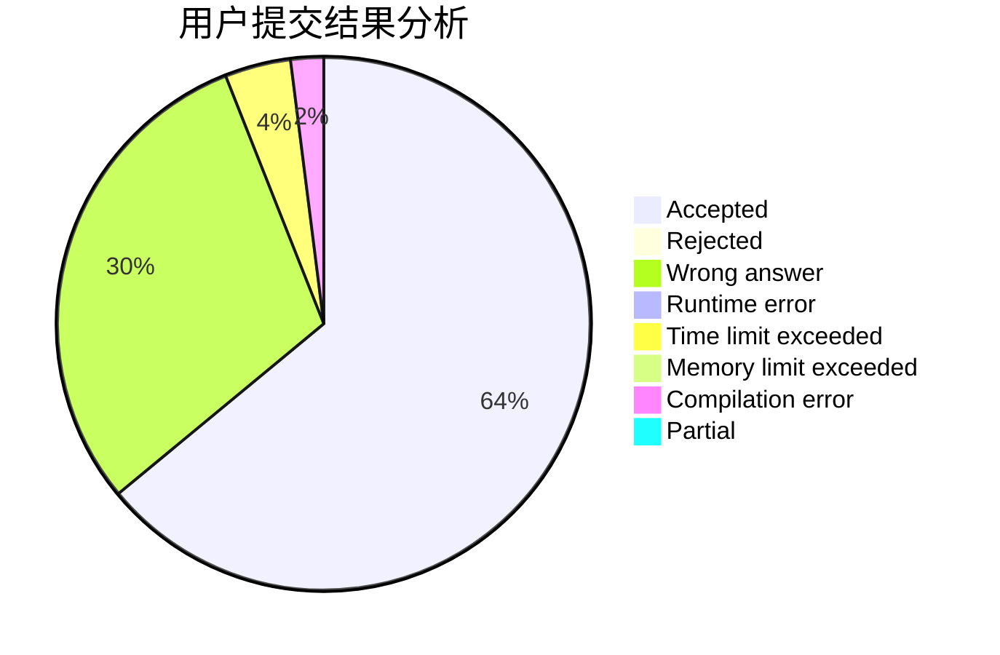
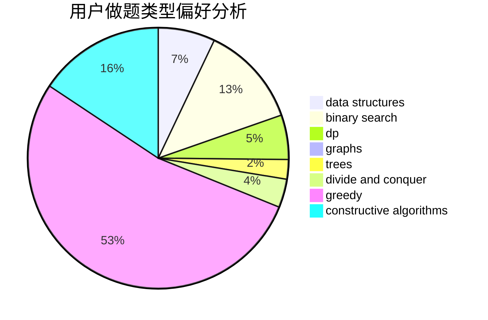
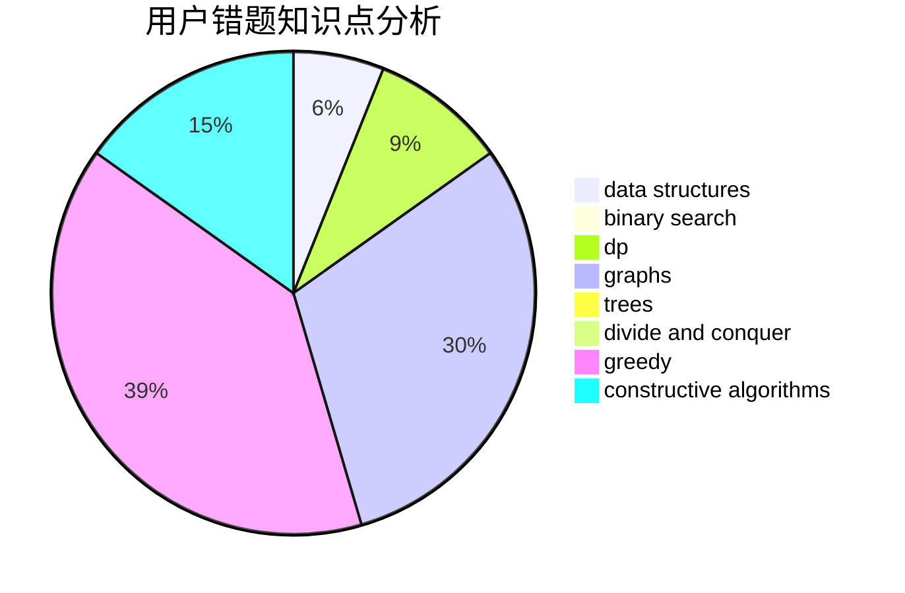

# Charon_wth

<!-- tabs:start -->

#### **用户提交结果分析**

#### **用户做题类型偏好分析**

#### **用户错题知识点分析**

<!-- tabs:end -->
# 推荐题目
[668A](https://codeforces.com/contest/668/problem/A)		dsu,graphs,sortings,trees		  
[321A](https://codeforces.com/contest/321/problem/A)		binary search,
                        implementation,
                        math		  
[215E](https://codeforces.com/contest/215/problem/E)		combinatorics,
                        dp,
                        number theory		  
[667C](https://codeforces.com/contest/667/problem/C)		dsu,graphs,sortings,trees		  
[667B](https://codeforces.com/contest/667/problem/B)		constructive algorithms,
                        geometry		  
[666E](https://codeforces.com/contest/666/problem/E)		data structures,
                        string suffix structures		  
[667A](https://codeforces.com/contest/667/problem/A)		geometry,
                        math		  
[651B](https://codeforces.com/contest/651/problem/B)		greedy,
                        sortings		  
[1129B](https://codeforces.com/contest/1129/problem/B)		constructive algorithms		  
[1045I](https://codeforces.com/contest/1045/problem/I)		hashing,
                        strings		  
