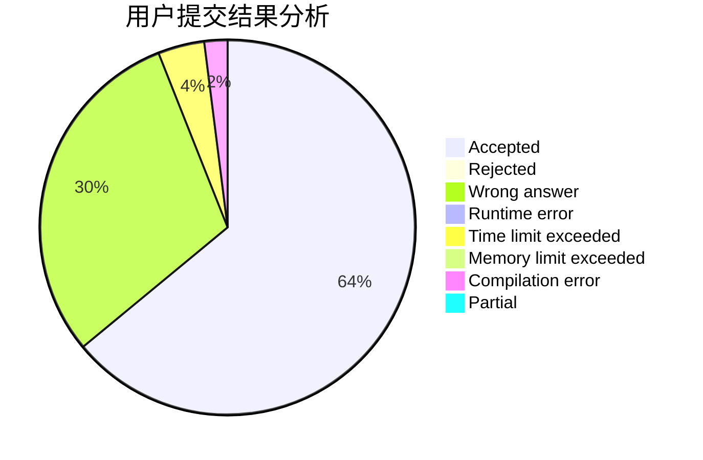
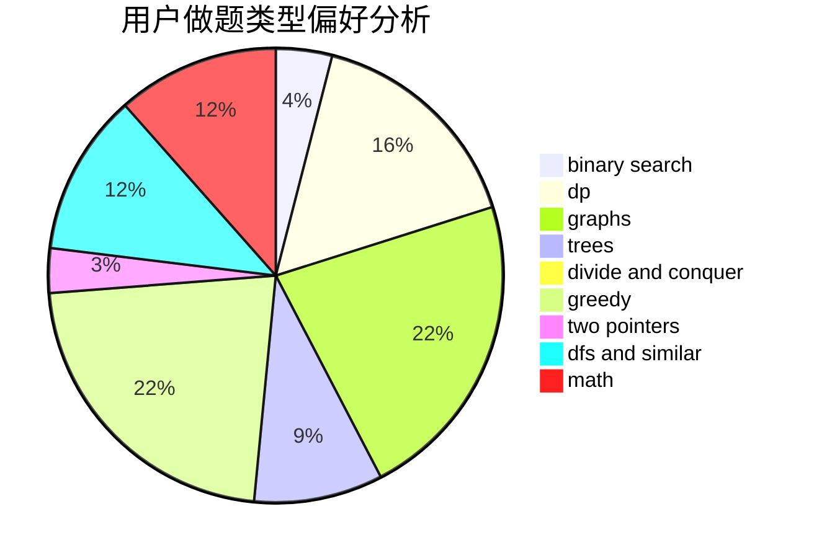

# Charon_wth

<!-- tabs:start -->

#### **用户提交结果分析**

#### **用户做题类型偏好分析**

<!-- tabs:end -->
# 推荐题目
[68A](https://codeforces.com/contest/68/problem/A)
[351E](https://codeforces.com/contest/351/problem/E)
[235B](https://codeforces.com/contest/235/problem/B)
[689D](https://codeforces.com/contest/689/problem/D)
[689B](https://codeforces.com/contest/689/problem/B)
[688D](https://codeforces.com/contest/688/problem/D)
[689A](https://codeforces.com/contest/689/problem/A)
[675B](https://codeforces.com/contest/675/problem/B)
[1131B](https://codeforces.com/contest/1131/problem/B)
[1046H](https://codeforces.com/contest/1046/problem/H)
