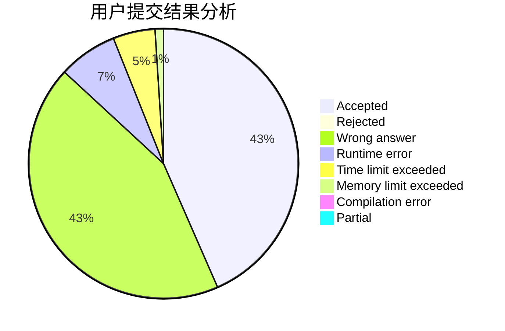
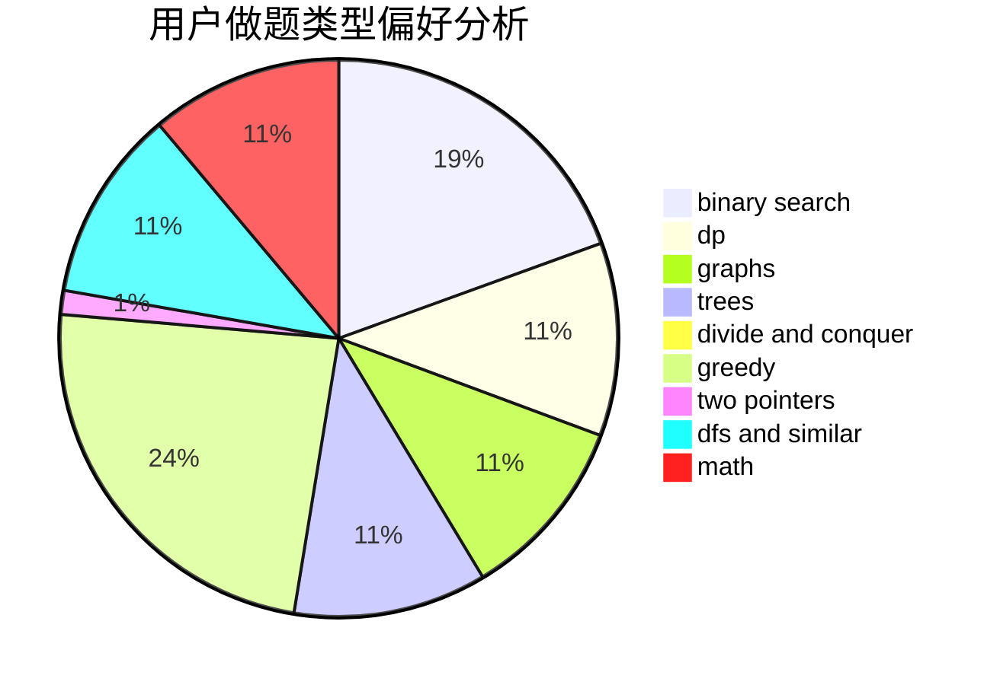

# ykx

<!-- tabs:start -->

#### **用户提交结果分析**

#### **用户做题类型偏好分析**

<!-- tabs:end -->
# 推荐题目
[548A](https://codeforces.com/contest/548/problem/A)
[1028G](https://codeforces.com/contest/1028/problem/G)
[1265C](https://codeforces.com/contest/1265/problem/C)
[1287B](https://codeforces.com/contest/1287/problem/B)
[1358F](https://codeforces.com/contest/1358/problem/F)
[1238E](https://codeforces.com/contest/1238/problem/E)
[853C](https://codeforces.com/contest/853/problem/C)
[901C](https://codeforces.com/contest/901/problem/C)
[899E](https://codeforces.com/contest/899/problem/E)
[1199E](https://codeforces.com/contest/1199/problem/E)
