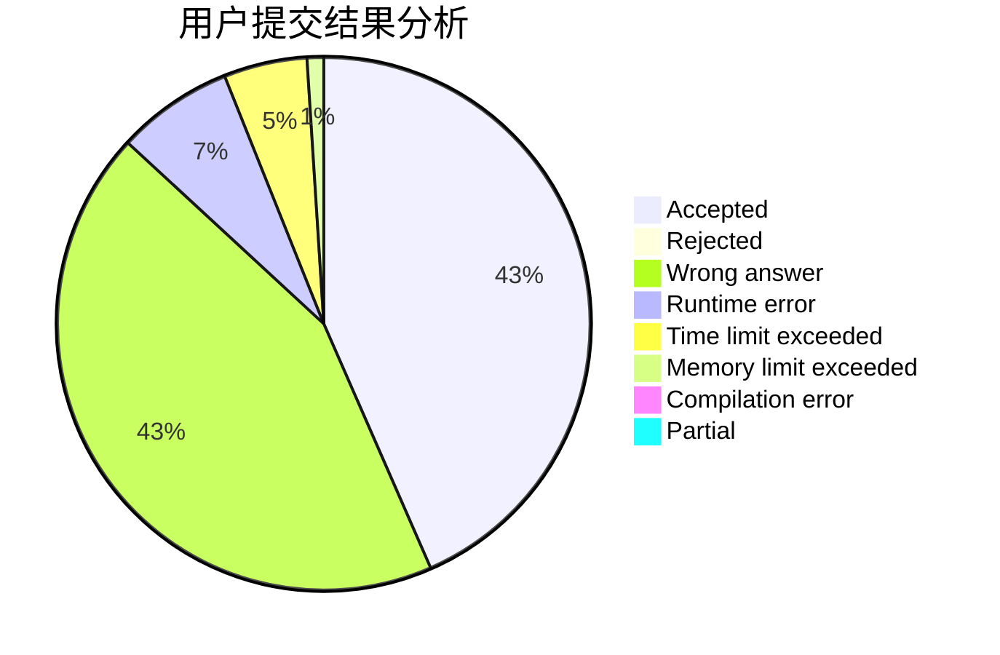
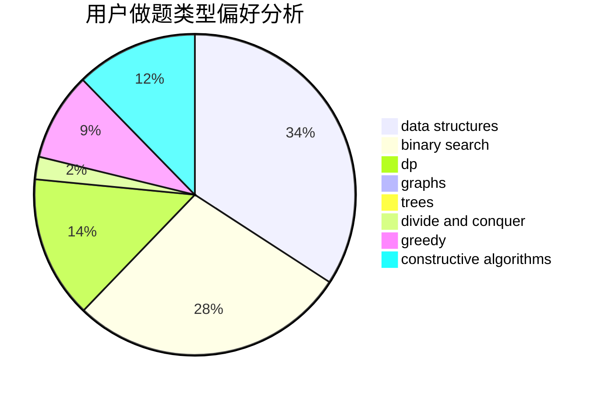
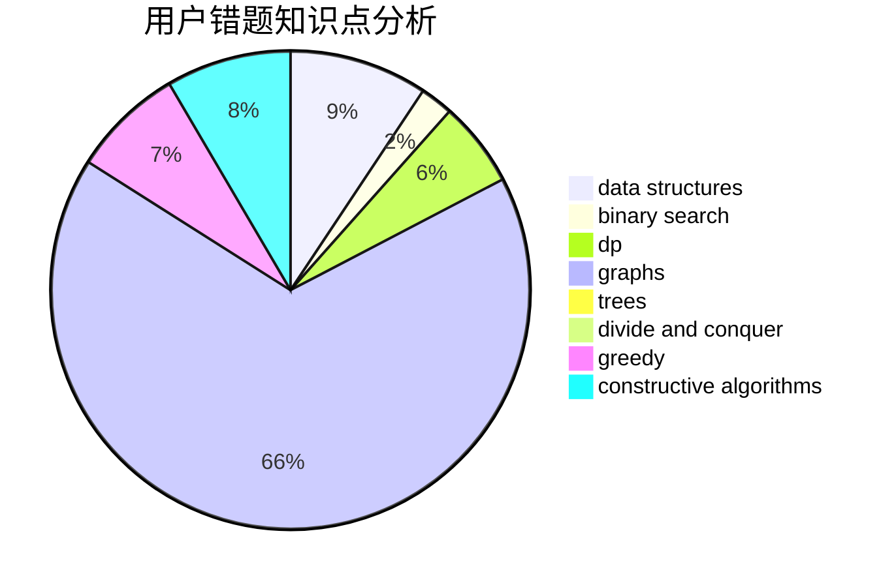

# ykx

<!-- tabs:start -->

#### **用户提交结果分析**

#### **用户做题类型偏好分析**

#### **用户错题知识点分析**

<!-- tabs:end -->
# 推荐题目
[522D](https://codeforces.com/contest/522/problem/D)		*special problem,
                        data structures		  
[1028C](https://codeforces.com/contest/1028/problem/C)		geometry,
                        implementation,
                        sortings		  
[125A](https://codeforces.com/contest/125/problem/A)		math		  
[1281B](https://codeforces.com/contest/1281/problem/B)		greedy		  
[1352B](https://codeforces.com/contest/1352/problem/B)		constructive algorithms,
                        math		  
[1230A](https://codeforces.com/contest/1230/problem/A)		brute force,
                        implementation		  
[835E](https://codeforces.com/contest/835/problem/E)		binary search,
                        constructive algorithms,
                        interactive		  
[883I](https://codeforces.com/contest/883/problem/I)		binary search,
                        dp		  
[879A](https://codeforces.com/contest/879/problem/A)		implementation		  
[1195C](https://codeforces.com/contest/1195/problem/C)		dp		  
