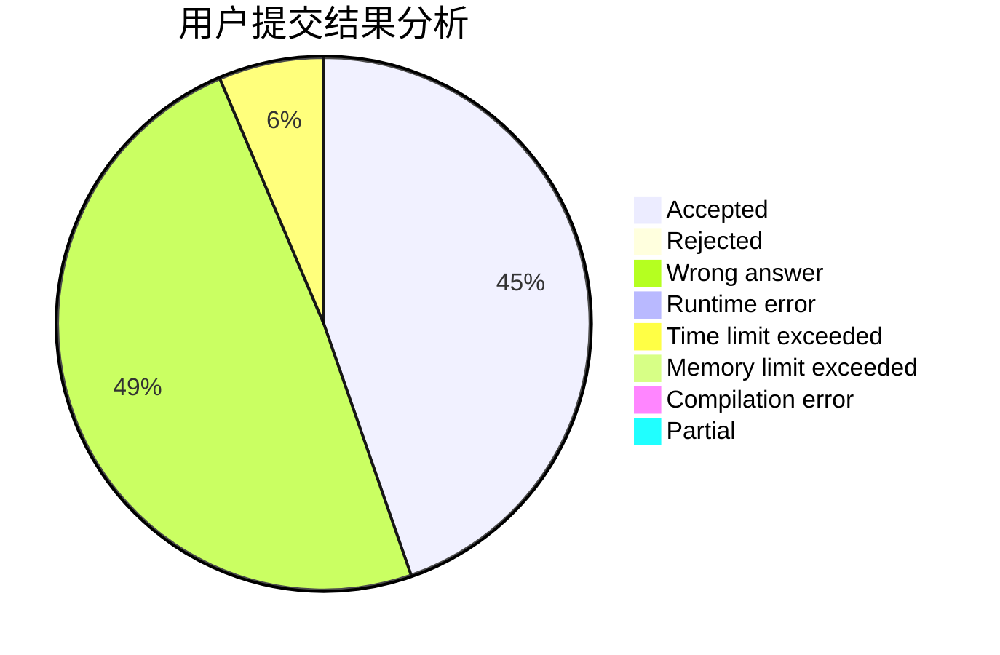
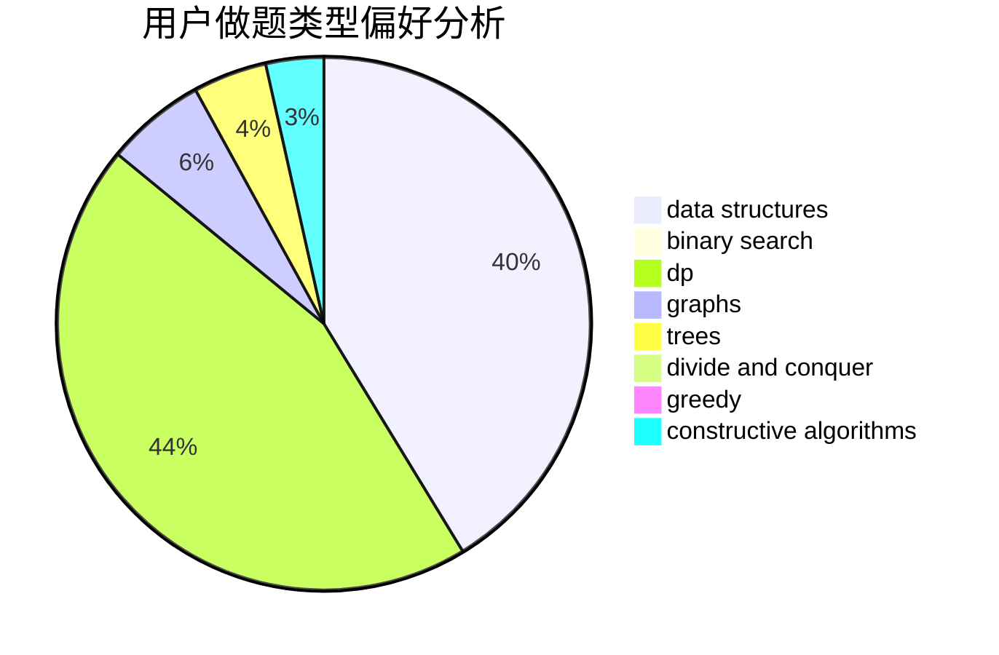
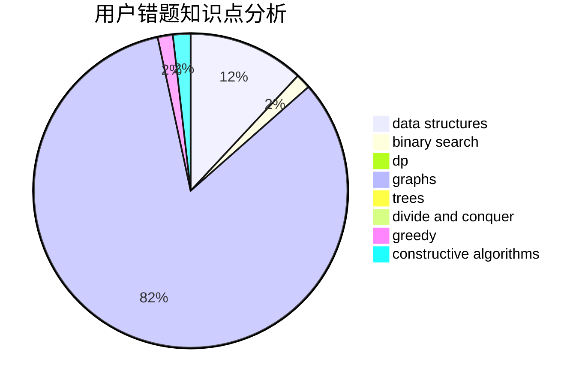

# yljrpyq

<!-- tabs:start -->

#### **用户提交结果分析**

#### **用户做题类型偏好分析**

#### **用户错题知识点分析**

<!-- tabs:end -->
# 推荐题目
[617E](https://codeforces.com/contest/617/problem/E)		data structures		  
[386C](https://codeforces.com/contest/386/problem/C)		dp,
                        strings,
                        two pointers		  
[1031C](https://codeforces.com/contest/1031/problem/C)		greedy		  
[611E](https://codeforces.com/contest/611/problem/E)		data structures,
                        greedy,
                        sortings		  
[218A](https://codeforces.com/contest/218/problem/A)		brute force,
                        constructive algorithms,
                        implementation		  
[761A](https://codeforces.com/contest/761/problem/A)		brute force,
                        constructive algorithms,
                        implementation,
                        math		  
[557B](https://codeforces.com/contest/557/problem/B)		constructive algorithms,
                        implementation,
                        math,
                        sortings		  
[37A](https://codeforces.com/contest/37/problem/A)		sortings		  
[1425E](https://codeforces.com/contest/1425/problem/E)		greedy,
                        implementation		  
[288B](https://codeforces.com/contest/288/problem/B)		combinatorics		  
