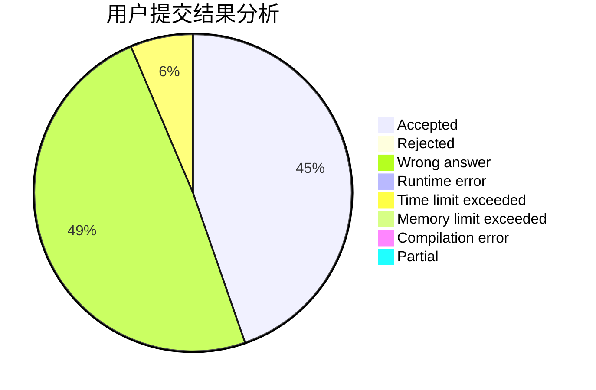
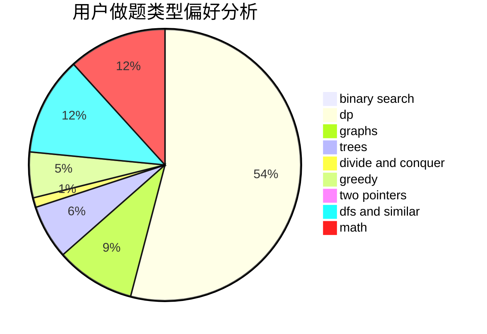

# yljrpyq

<!-- tabs:start -->

#### **用户提交结果分析**

#### **用户做题类型偏好分析**

<!-- tabs:end -->
# 推荐题目
[617E](https://codeforces.com/contest/617/problem/E)
[386C](https://codeforces.com/contest/386/problem/C)
[1031C](https://codeforces.com/contest/1031/problem/C)
[611E](https://codeforces.com/contest/611/problem/E)
[218A](https://codeforces.com/contest/218/problem/A)
[761A](https://codeforces.com/contest/761/problem/A)
[557B](https://codeforces.com/contest/557/problem/B)
[37A](https://codeforces.com/contest/37/problem/A)
[1425E](https://codeforces.com/contest/1425/problem/E)
[288B](https://codeforces.com/contest/288/problem/B)
