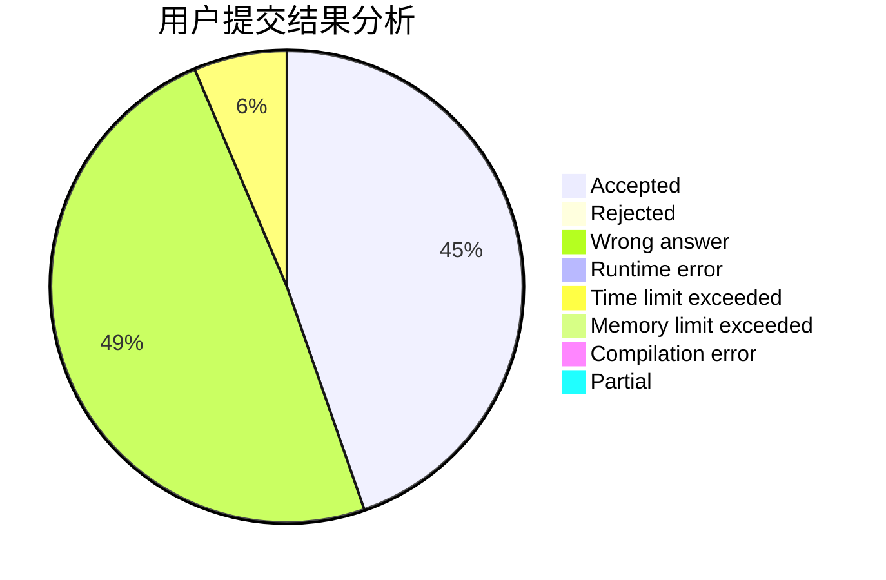
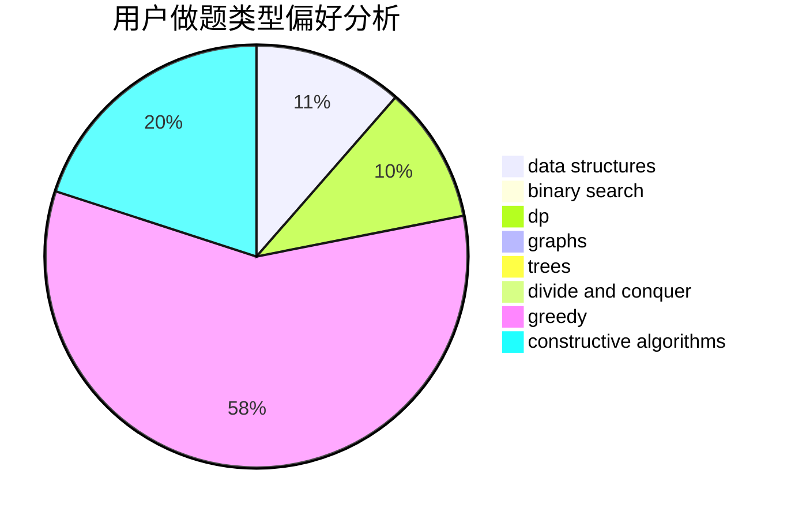
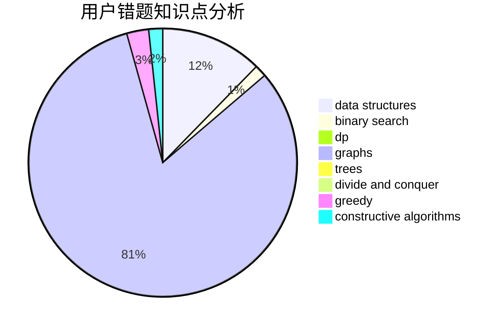

# yljrpyq

<!-- tabs:start -->

#### **用户提交结果分析**

#### **用户做题类型偏好分析**

#### **用户错题知识点分析**

<!-- tabs:end -->
# 推荐题目
[599D](https://codeforces.com/contest/599/problem/D)		brute force,
                        math		  
[359C](https://codeforces.com/contest/359/problem/C)		math,
                        number theory		  
[1030G](https://codeforces.com/contest/1030/problem/G)		number theory		  
[592C](https://codeforces.com/contest/592/problem/C)		math		  
[194E](https://codeforces.com/contest/194/problem/E)		dsu,graphs,sortings,trees		  
[73C](https://codeforces.com/contest/73/problem/C)		dp		  
[534F](https://codeforces.com/contest/534/problem/F)		bitmasks,
                        dp,
                        hashing,
                        meet-in-the-middle		  
[353D](https://codeforces.com/contest/353/problem/D)		constructive algorithms,
                        dp		  
[1418A](https://codeforces.com/contest/1418/problem/A)		math		  
[271D](https://codeforces.com/contest/271/problem/D)		data structures,
                        strings		  
