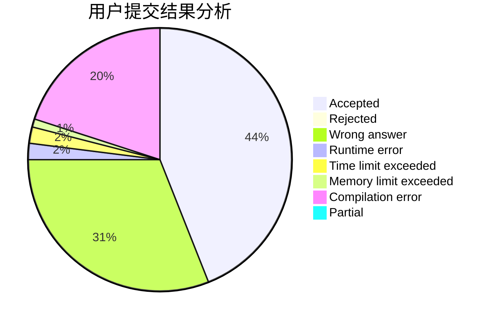
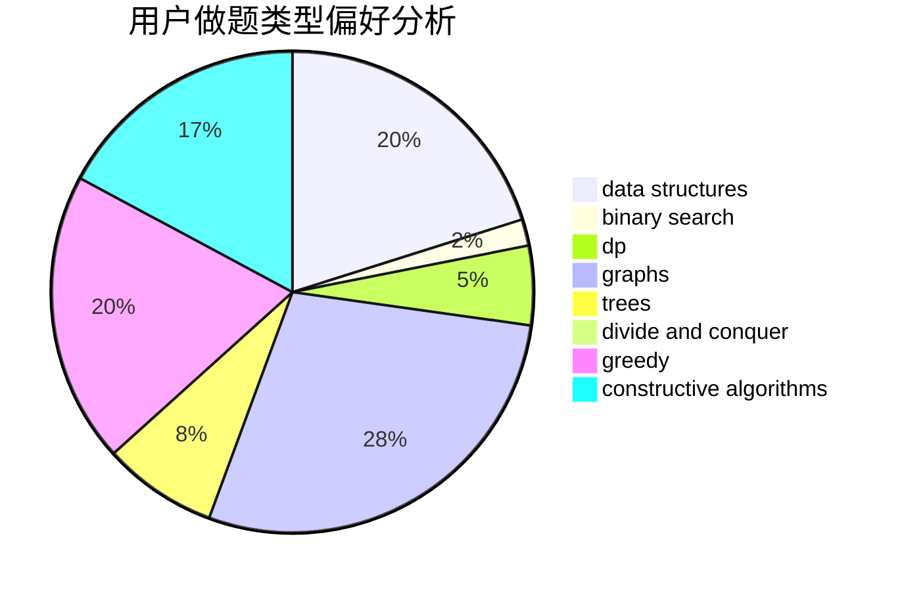
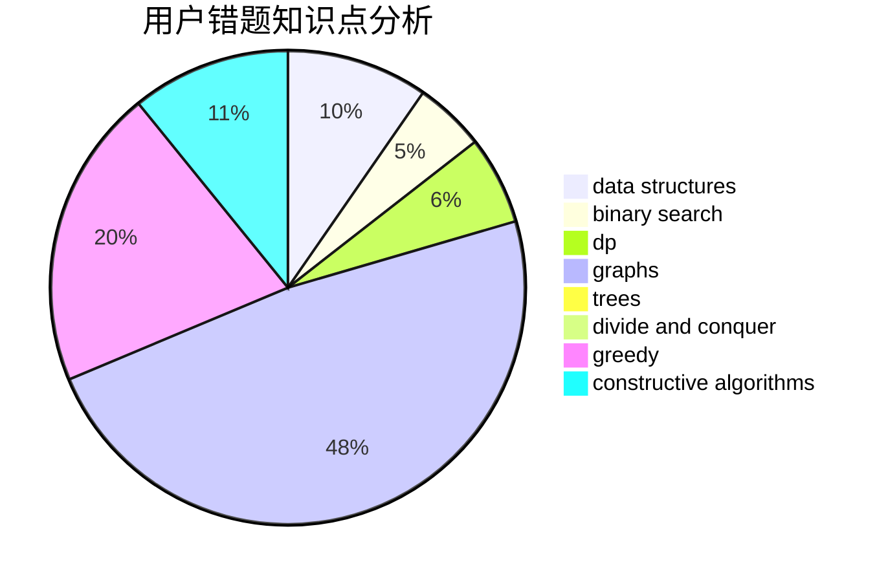

# yltx

<!-- tabs:start -->

#### **用户提交结果分析**

#### **用户做题类型偏好分析**

#### **用户错题知识点分析**

<!-- tabs:end -->
# 推荐题目
[1472B](https://codeforces.com/contest/1472/problem/B)		dp,
                        greedy,
                        math		  
[746A](https://codeforces.com/contest/746/problem/A)		implementation,
                        math		  
[1176F](https://codeforces.com/contest/1176/problem/F)		dp,
                        implementation,
                        sortings		  
[53D](https://codeforces.com/contest/53/problem/D)		sortings		  
[23A](https://codeforces.com/contest/23/problem/A)		brute force,
                        greedy		  
[114B](https://codeforces.com/contest/114/problem/B)		bitmasks,
                        brute force,
                        graphs		  
[1365B](https://codeforces.com/contest/1365/problem/B)		constructive algorithms,
                        implementation		  
[1202C](https://codeforces.com/contest/1202/problem/C)		brute force,
                        data structures,
                        dp,
                        greedy,
                        implementation,
                        math,
                        strings		  
[429D](https://codeforces.com/contest/429/problem/D)		data structures,
                        divide and conquer,
                        geometry		  
[1446C](https://codeforces.com/contest/1446/problem/C)		binary search,
                        bitmasks,
                        data structures,
                        divide and conquer,
                        dp,
                        trees		  
