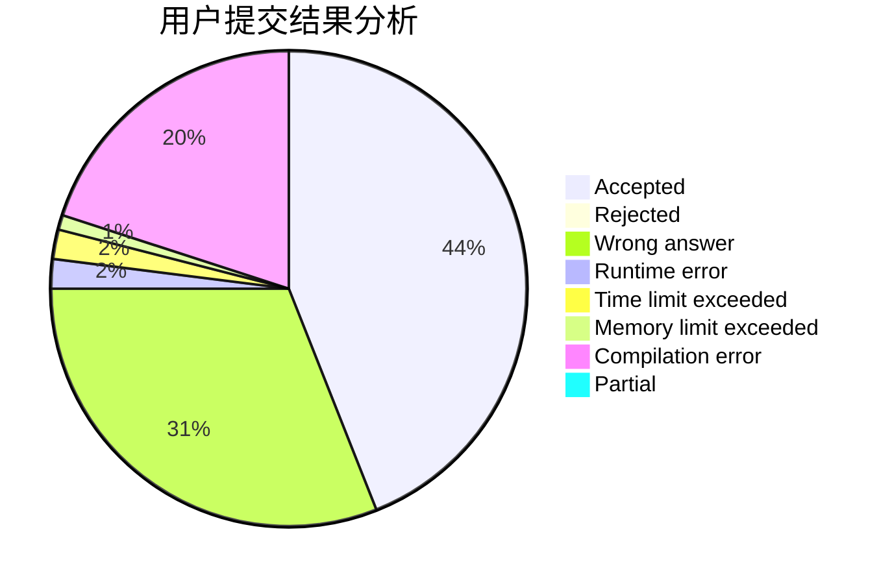
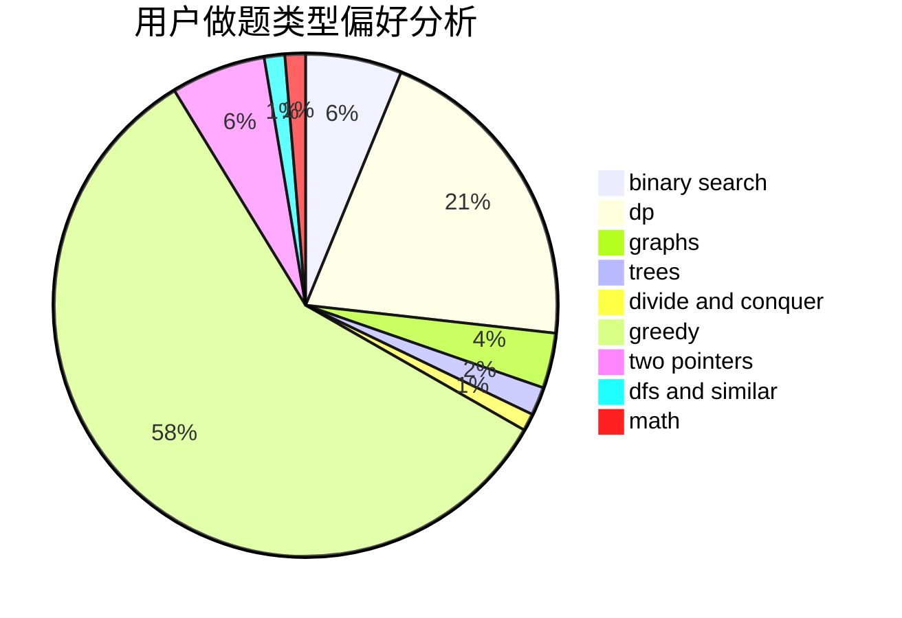

# yltx

<!-- tabs:start -->

#### **用户提交结果分析**

#### **用户做题类型偏好分析**

<!-- tabs:end -->
# 推荐题目
[1480B](https://codeforces.com/contest/1480/problem/B)
[765C](https://codeforces.com/contest/765/problem/C)
[117D](https://codeforces.com/contest/117/problem/D)
[560A](https://codeforces.com/contest/560/problem/A)
[260C](https://codeforces.com/contest/260/problem/C)
[1151E](https://codeforces.com/contest/1151/problem/E)
[1371F](https://codeforces.com/contest/1371/problem/F)
[1207A](https://codeforces.com/contest/1207/problem/A)
[450B](https://codeforces.com/contest/450/problem/B)
[1455E](https://codeforces.com/contest/1455/problem/E)
