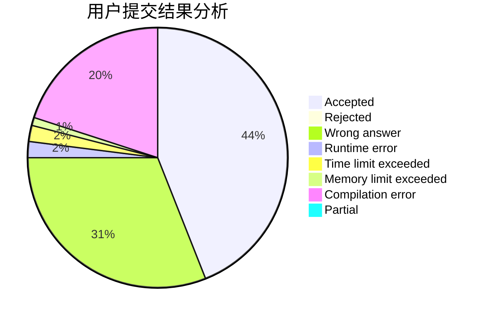
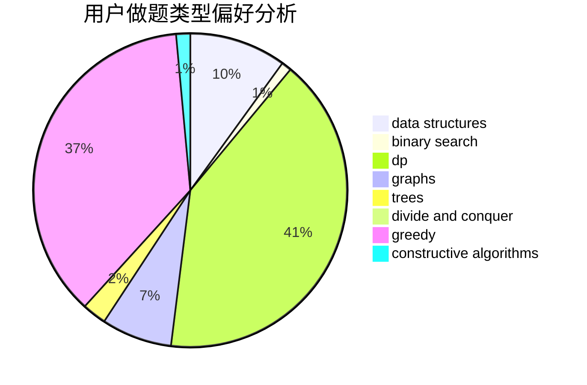
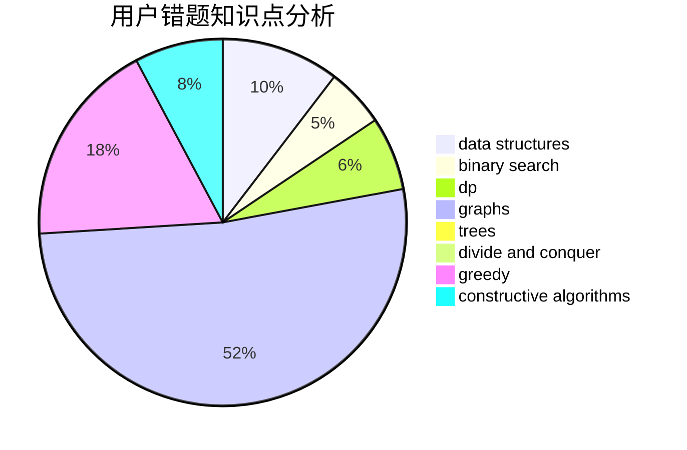

# yltx

<!-- tabs:start -->

#### **用户提交结果分析**

#### **用户做题类型偏好分析**

#### **用户错题知识点分析**

<!-- tabs:end -->
# 推荐题目
[1480B](https://codeforces.com/contest/1480/problem/B)		greedy,
                        implementation,
                        sortings		  
[765C](https://codeforces.com/contest/765/problem/C)		math		  
[117D](https://codeforces.com/contest/117/problem/D)		divide and conquer,
                        math		  
[560A](https://codeforces.com/contest/560/problem/A)		implementation,
                        sortings		  
[260C](https://codeforces.com/contest/260/problem/C)		constructive algorithms,
                        greedy,
                        implementation		  
[1151E](https://codeforces.com/contest/1151/problem/E)		combinatorics,
                        data structures,
                        dp,
                        math		  
[1371F](https://codeforces.com/contest/1371/problem/F)		data structures,
                        divide and conquer,
                        implementation		  
[1207A](https://codeforces.com/contest/1207/problem/A)		brute force,
                        greedy,
                        implementation,
                        math		  
[450B](https://codeforces.com/contest/450/problem/B)		implementation,
                        math		  
[1455E](https://codeforces.com/contest/1455/problem/E)		brute force,
                        constructive algorithms,
                        flows,
                        geometry,
                        greedy,
                        implementation,
                        math,
                        ternary search		  
