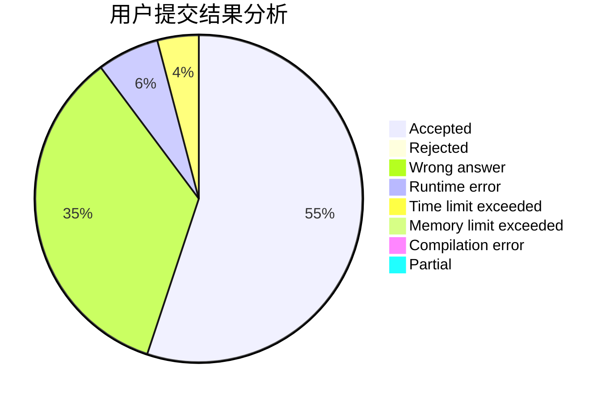
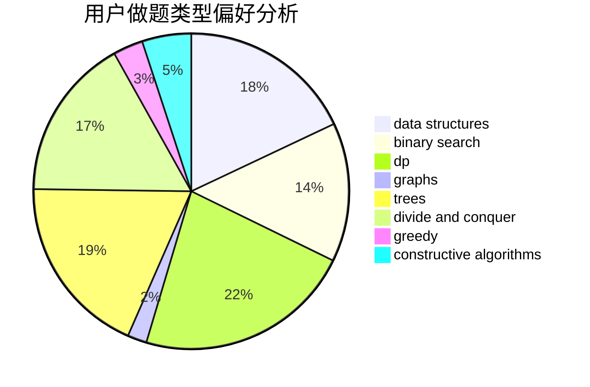
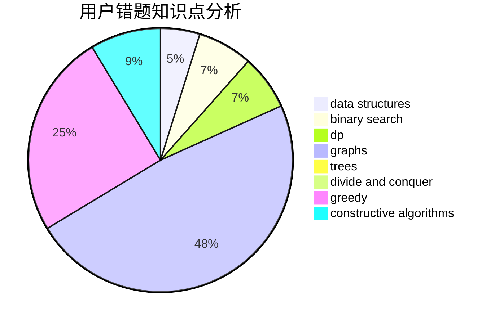

# ympc

<!-- tabs:start -->

#### **用户提交结果分析**

#### **用户做题类型偏好分析**

#### **用户错题知识点分析**

<!-- tabs:end -->
# 推荐题目
[1236B](https://codeforces.com/contest/1236/problem/B)		combinatorics,
                        math		  
[36B](https://codeforces.com/contest/36/problem/B)		implementation		  
[914H](https://codeforces.com/contest/914/problem/H)		combinatorics,
                        dp,
                        games,
                        trees		  
[260A](https://codeforces.com/contest/260/problem/A)		implementation,
                        math		  
[3161](https://codeforces.com/contest/316/problem/1)		dsu,graphs,sortings,trees		  
[388A](https://codeforces.com/contest/388/problem/A)		greedy,
                        sortings		  
[575B](https://codeforces.com/contest/575/problem/B)		dfs and similar,
                        graphs,
                        trees		  
[313E](https://codeforces.com/contest/313/problem/E)		constructive algorithms,
                        data structures,
                        dsu,
                        greedy		  
[756D](https://codeforces.com/contest/756/problem/D)		brute force,
                        combinatorics,
                        dp,
                        string suffix structures		  
[1039E](https://codeforces.com/contest/1039/problem/E)		data structures		  
