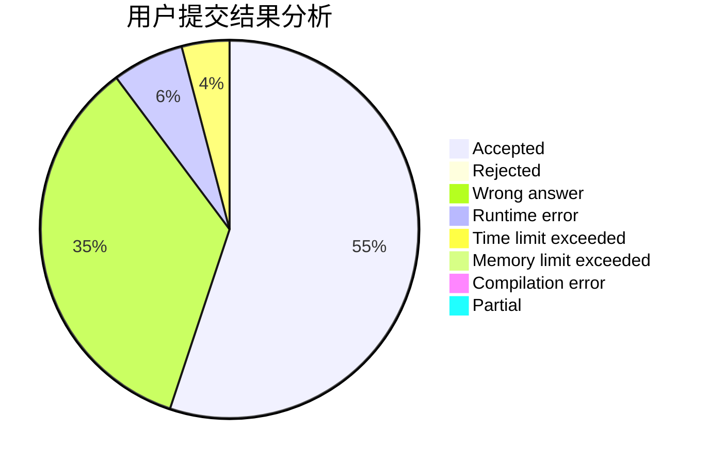
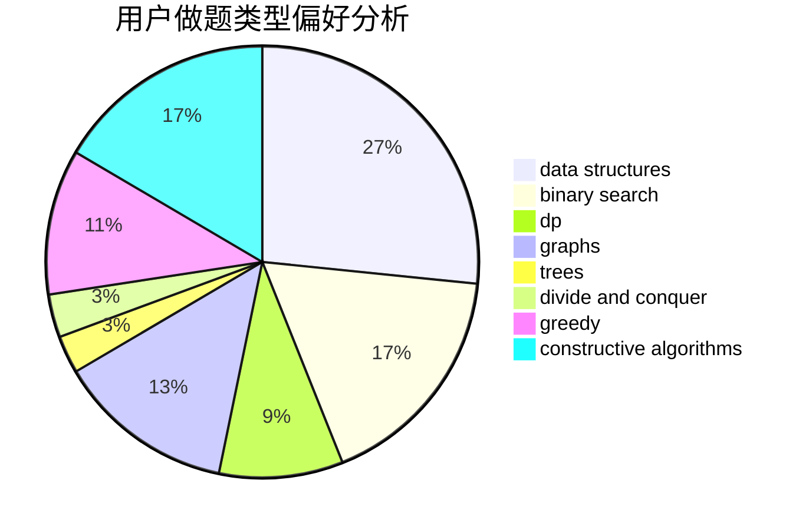
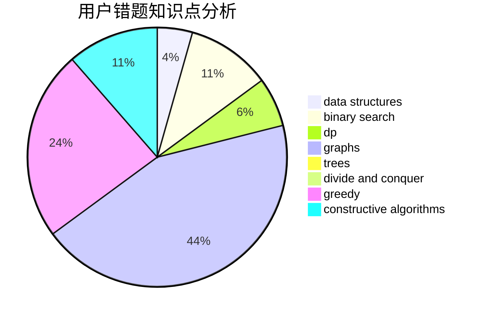

# ympc

<!-- tabs:start -->

#### **用户提交结果分析**

#### **用户做题类型偏好分析**

#### **用户错题知识点分析**

<!-- tabs:end -->
# 推荐题目
[1227D2](https://codeforces.com/contest/1227D/problem/2)		data structures,
                        greedy		  
[343A](https://codeforces.com/contest/343/problem/A)		math,
                        number theory		  
[898F](https://codeforces.com/contest/898/problem/F)		brute force,
                        hashing,
                        math		  
[238D](https://codeforces.com/contest/238/problem/D)		data structures,
                        implementation		  
[299B](https://codeforces.com/contest/299/problem/B)		brute force,
                        implementation		  
[35C](https://codeforces.com/contest/35/problem/C)		brute force,
                        dfs and similar,
                        shortest paths		  
[54B](https://codeforces.com/contest/54/problem/B)		hashing,
                        implementation		  
[297A](https://codeforces.com/contest/297/problem/A)		constructive algorithms		  
[735C](https://codeforces.com/contest/735/problem/C)		combinatorics,
                        constructive algorithms,
                        greedy,
                        math		  
[1039B](https://codeforces.com/contest/1039/problem/B)		binary search,
                        interactive,
                        probabilities		  
