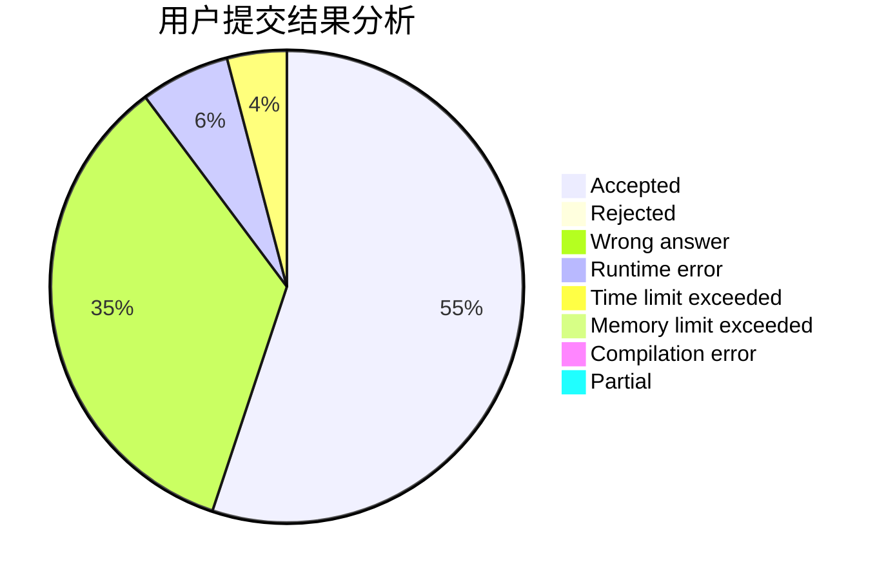
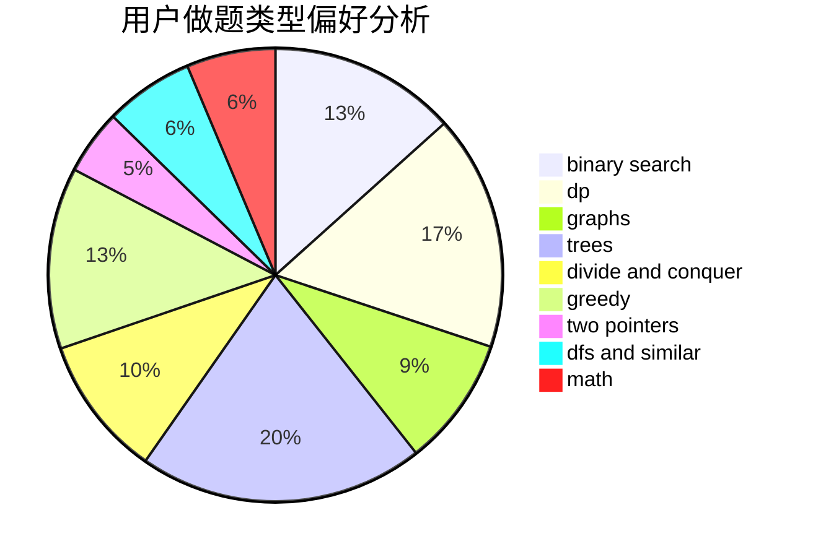

# ympc

<!-- tabs:start -->

#### **用户提交结果分析**

#### **用户做题类型偏好分析**

<!-- tabs:end -->
# 推荐题目
[1236B](https://codeforces.com/contest/1236/problem/B)
[36B](https://codeforces.com/contest/36/problem/B)
[914H](https://codeforces.com/contest/914/problem/H)
[260A](https://codeforces.com/contest/260/problem/A)
[3161](https://codeforces.com/contest/316/problem/1)
[388A](https://codeforces.com/contest/388/problem/A)
[575B](https://codeforces.com/contest/575/problem/B)
[313E](https://codeforces.com/contest/313/problem/E)
[756D](https://codeforces.com/contest/756/problem/D)
[1039E](https://codeforces.com/contest/1039/problem/E)
