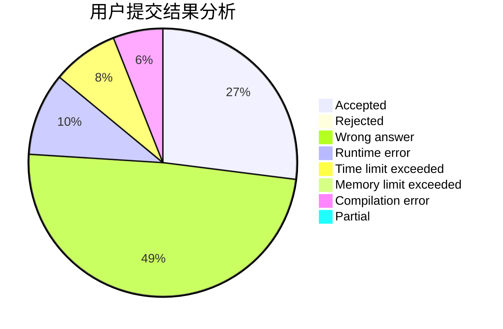
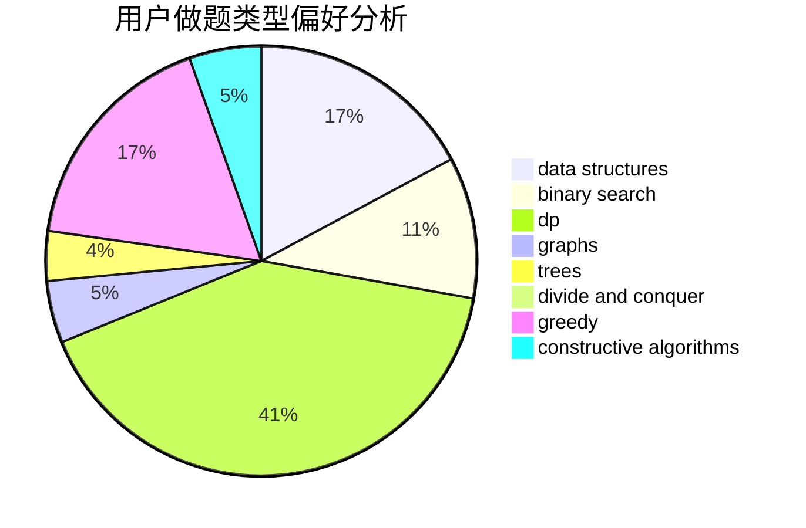
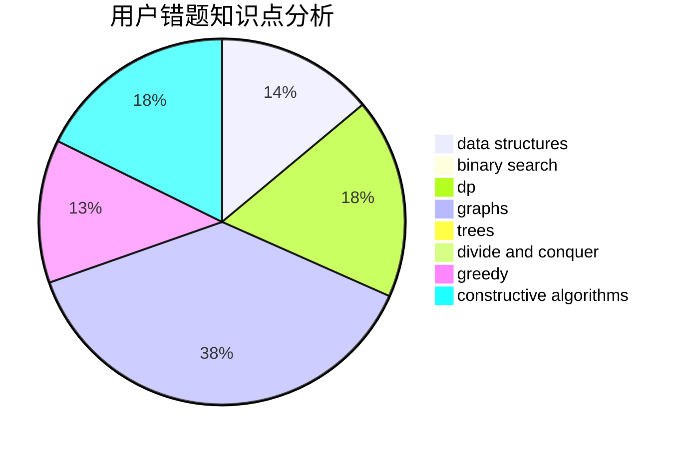

# ynycoding

<!-- tabs:start -->

#### **用户提交结果分析**

#### **用户做题类型偏好分析**

#### **用户错题知识点分析**

<!-- tabs:end -->
# 推荐题目
[1249F](https://codeforces.com/contest/1249/problem/F)		dp,
                        trees		  
[1092E](https://codeforces.com/contest/1092/problem/E)		constructive algorithms,
                        dfs and similar,
                        greedy,
                        trees		  
[1053E](https://codeforces.com/contest/1053/problem/E)		constructive algorithms,
                        trees		  
[1175C](https://codeforces.com/contest/1175/problem/C)		binary search,
                        brute force,
                        greedy		  
[1234D](https://codeforces.com/contest/1234/problem/D)		data structures		  
[1163B2](https://codeforces.com/contest/1163B/problem/2)		data structures,
                        implementation		  
[280C](https://codeforces.com/contest/280/problem/C)		implementation,
                        math,
                        probabilities,
                        trees		  
[1370A](https://codeforces.com/contest/1370/problem/A)		greedy,
                        implementation,
                        math,
                        number theory		  
[120H](https://codeforces.com/contest/120/problem/H)		graph matchings		  
[464B](https://codeforces.com/contest/464/problem/B)		brute force,
                        geometry		  
