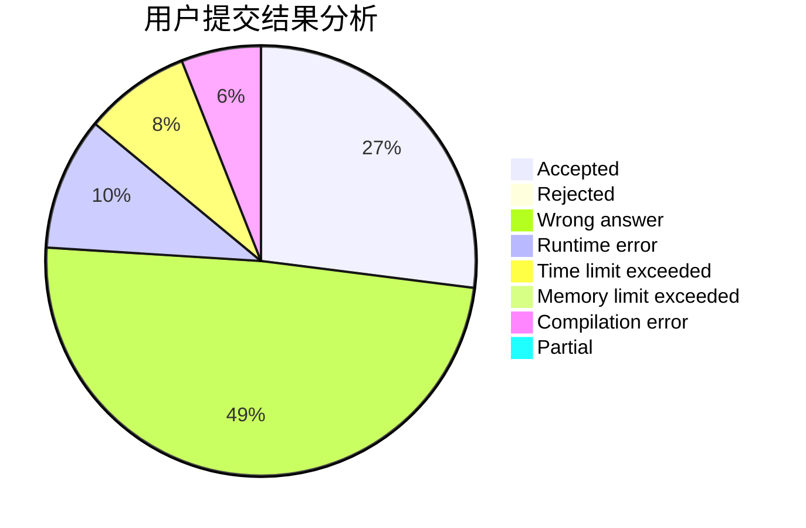
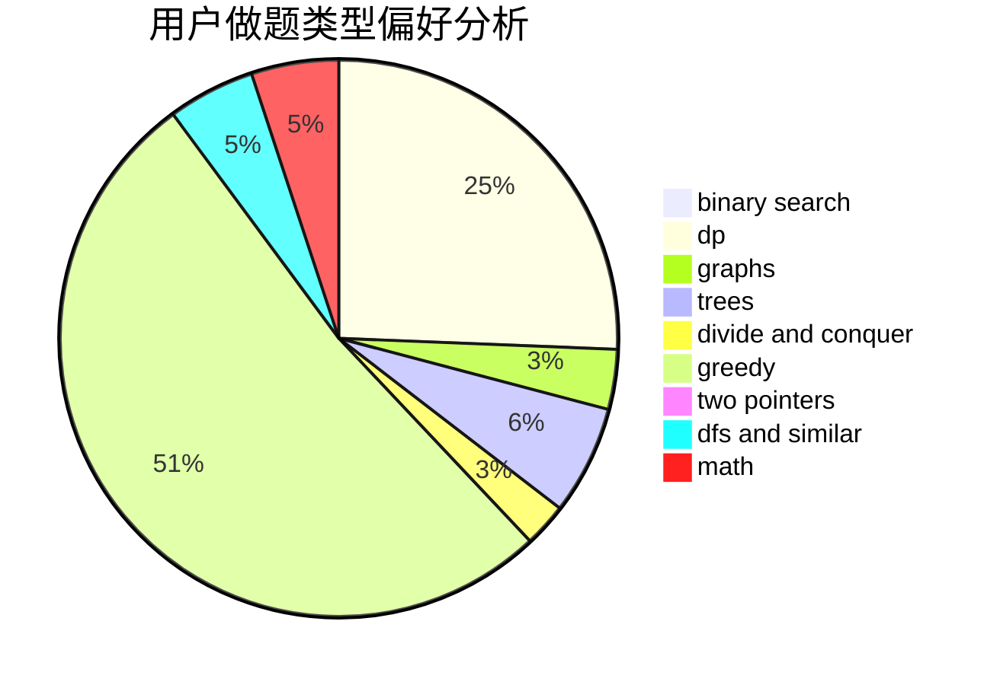

# ynycoding

<!-- tabs:start -->

#### **用户提交结果分析**

#### **用户做题类型偏好分析**

<!-- tabs:end -->
# 推荐题目
[1253E](https://codeforces.com/contest/1253/problem/E)
[1093B](https://codeforces.com/contest/1093/problem/B)
[1054C](https://codeforces.com/contest/1054/problem/C)
[1178C](https://codeforces.com/contest/1178/problem/C)
[1240A](https://codeforces.com/contest/1240/problem/A)
[1164Q](https://codeforces.com/contest/1164/problem/Q)
[296D](https://codeforces.com/contest/296/problem/D)
[13783](https://codeforces.com/contest/1378/problem/3)
[12162](https://codeforces.com/contest/1216/problem/2)
[484A](https://codeforces.com/contest/484/problem/A)
