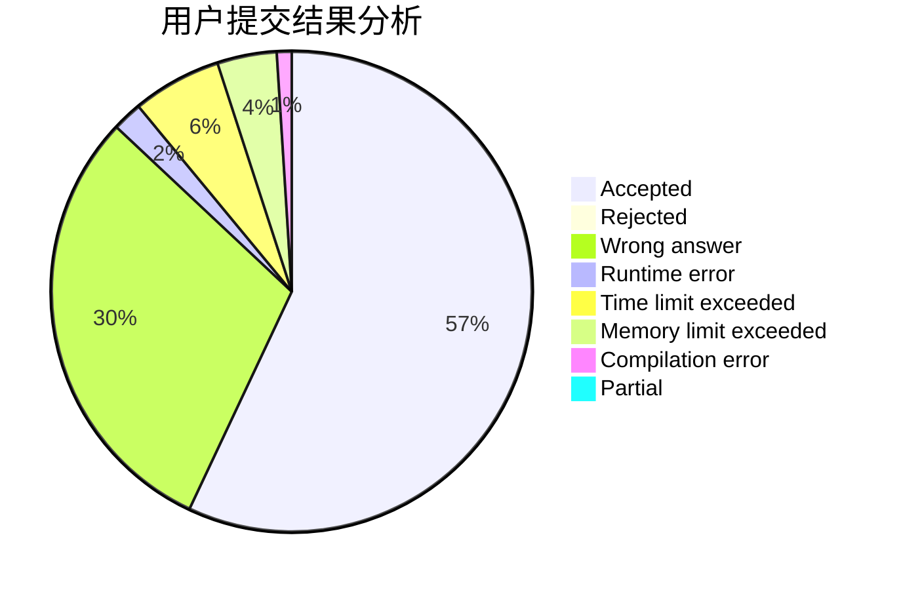
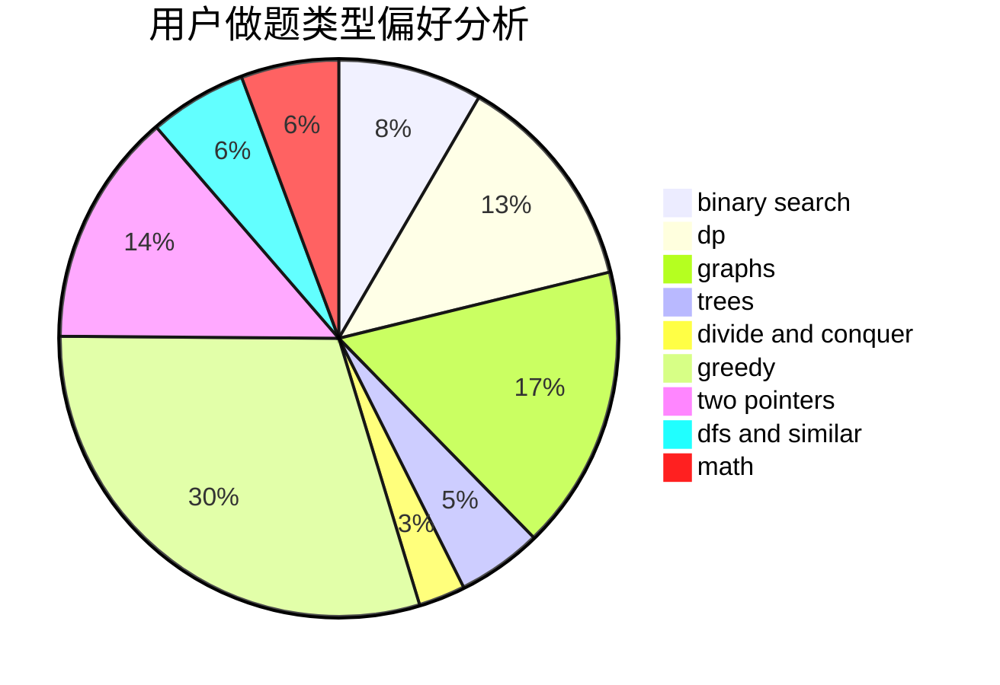

# yolo

<!-- tabs:start -->

#### **用户提交结果分析**

#### **用户做题类型偏好分析**

<!-- tabs:end -->
# 推荐题目
[343A](https://codeforces.com/contest/343/problem/A)
[497D](https://codeforces.com/contest/497/problem/D)
[1182C](https://codeforces.com/contest/1182/problem/C)
[789D](https://codeforces.com/contest/789/problem/D)
[1000G](https://codeforces.com/contest/1000/problem/G)
[1147A](https://codeforces.com/contest/1147/problem/A)
[843B](https://codeforces.com/contest/843/problem/B)
[1155A](https://codeforces.com/contest/1155/problem/A)
[1141B](https://codeforces.com/contest/1141/problem/B)
[451A](https://codeforces.com/contest/451/problem/A)
