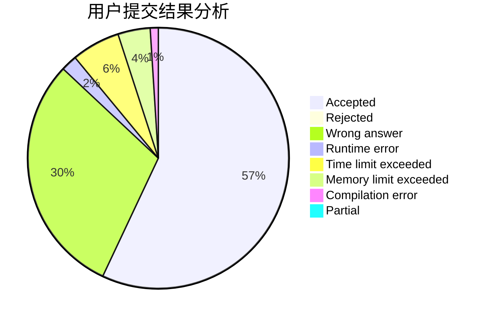
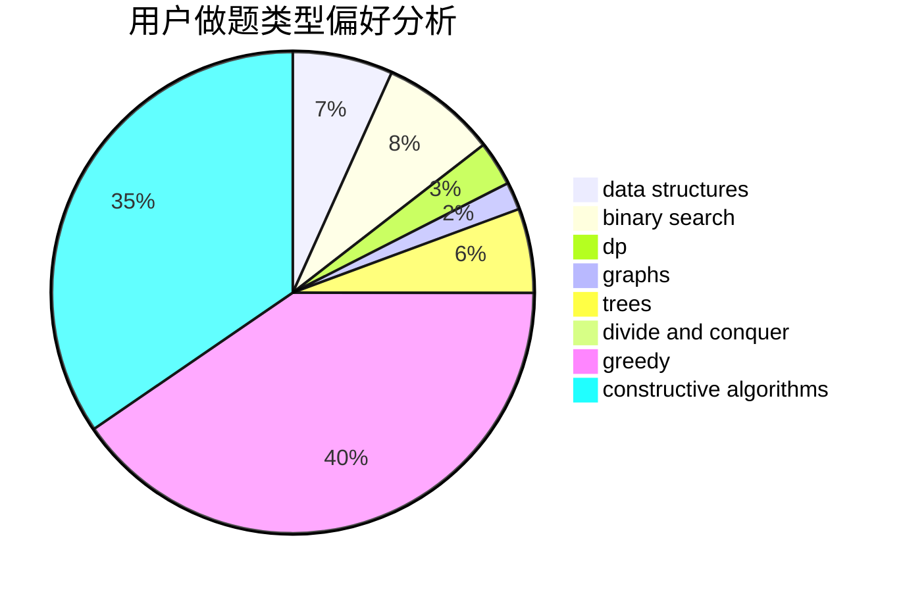
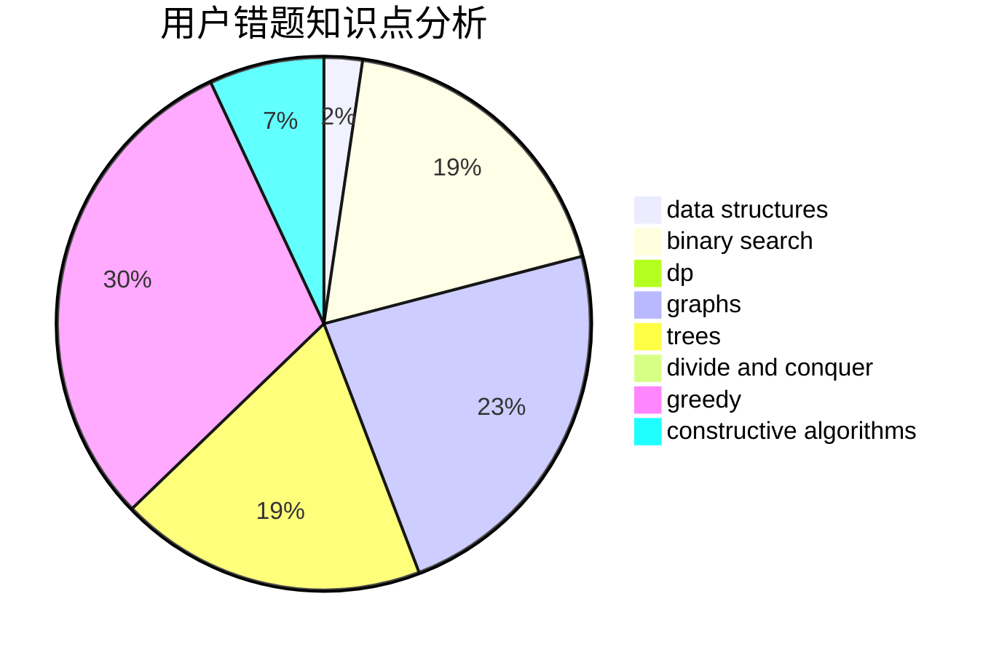

# yolo

<!-- tabs:start -->

#### **用户提交结果分析**

#### **用户做题类型偏好分析**

#### **用户错题知识点分析**

<!-- tabs:end -->
# 推荐题目
[316E2](https://codeforces.com/contest/316E/problem/2)		data structures,
                        math		  
[477D](https://codeforces.com/contest/477/problem/D)		dp,
                        strings		  
[1179D](https://codeforces.com/contest/1179/problem/D)		data structures,
                        dp,
                        trees		  
[76C](https://codeforces.com/contest/76/problem/C)		bitmasks,
                        dp,
                        math		  
[1000G](https://codeforces.com/contest/1000/problem/G)		data structures,
                        dp,
                        trees		  
[1144G](https://codeforces.com/contest/1144/problem/G)		dp,
                        greedy		  
[825B](https://codeforces.com/contest/825/problem/B)		brute force,
                        implementation		  
[1153A](https://codeforces.com/contest/1153/problem/A)		brute force,
                        math		  
[113B](https://codeforces.com/contest/113/problem/B)		brute force,
                        data structures,
                        hashing,
                        strings		  
[429E](https://codeforces.com/contest/429/problem/E)		graphs		  
