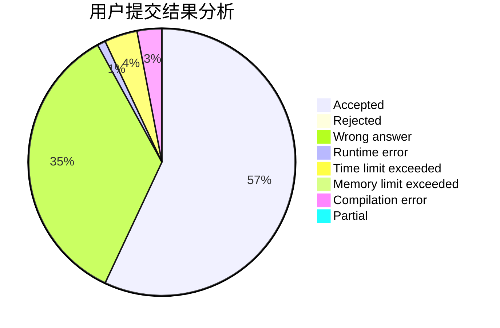
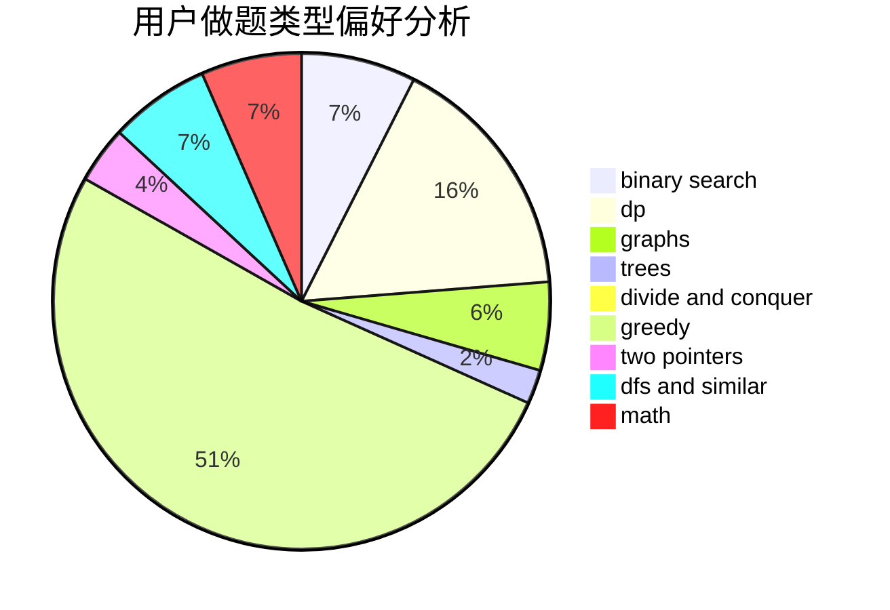

# youngsystem

<!-- tabs:start -->

#### **用户提交结果分析**

#### **用户做题类型偏好分析**

<!-- tabs:end -->
# 推荐题目
[1407E](https://codeforces.com/contest/1407/problem/E)
[580D](https://codeforces.com/contest/580/problem/D)
[782A](https://codeforces.com/contest/782/problem/A)
[1065B](https://codeforces.com/contest/1065/problem/B)
[1144F](https://codeforces.com/contest/1144/problem/F)
[1263C](https://codeforces.com/contest/1263/problem/C)
[776D](https://codeforces.com/contest/776/problem/D)
[1330D](https://codeforces.com/contest/1330/problem/D)
[33A](https://codeforces.com/contest/33/problem/A)
[617E](https://codeforces.com/contest/617/problem/E)
