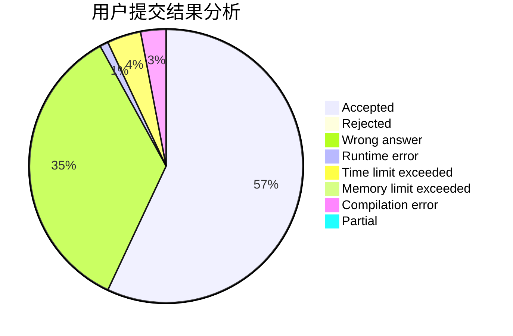
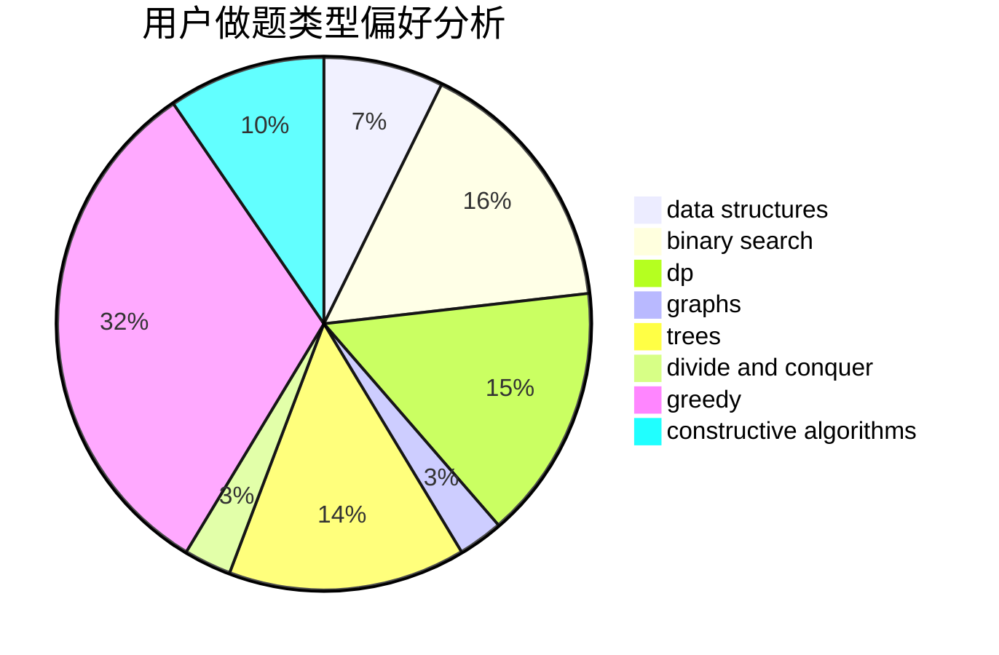

# youngsystem

<!-- tabs:start -->

#### **用户提交结果分析**

#### **用户做题类型偏好分析**

#### **用户错题知识点分析**

<!-- tabs:end -->
# 推荐题目
[1398F](https://codeforces.com/contest/1398/problem/F)		binary search,
                        data structures,
                        dp,
                        greedy,
                        two pointers		  
[557C](https://codeforces.com/contest/557/problem/C)		brute force,
                        data structures,
                        dp,
                        greedy,
                        math,
                        sortings		  
[763C](https://codeforces.com/contest/763/problem/C)		brute force,
                        implementation,
                        math,
                        number theory		  
[1064E](https://codeforces.com/contest/1064/problem/E)		dsu,graphs,sortings,trees		  
[1142D](https://codeforces.com/contest/1142/problem/D)		dp		  
[1256A](https://codeforces.com/contest/1256/problem/A)		math		  
[757E](https://codeforces.com/contest/757/problem/E)		brute force,
                        combinatorics,
                        dp,
                        number theory		  
[1324B](https://codeforces.com/contest/1324/problem/B)		brute force,
                        strings		  
[316A2](https://codeforces.com/contest/316A/problem/2)		math		  
[599D](https://codeforces.com/contest/599/problem/D)		brute force,
                        math		  
