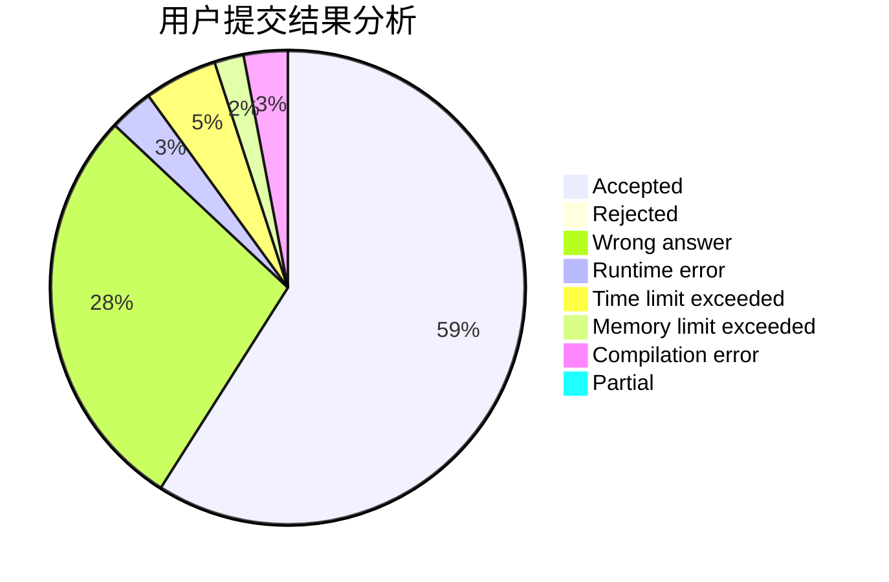
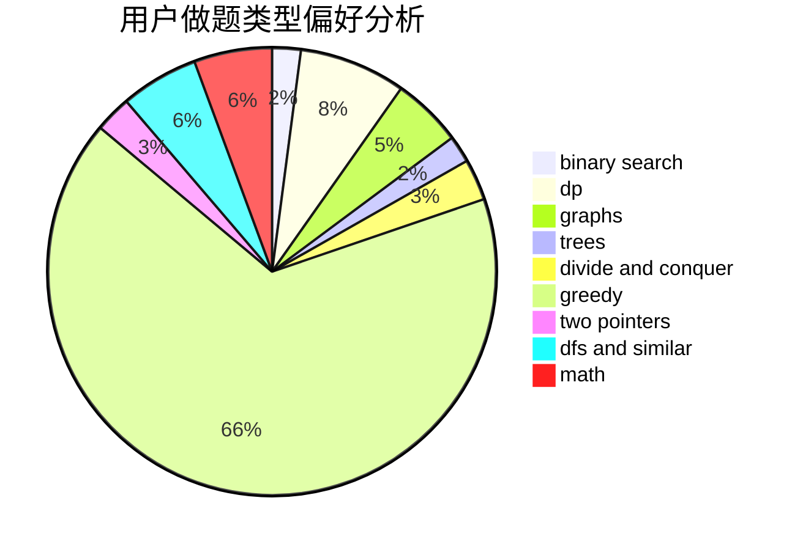

# youtsuha

<!-- tabs:start -->

#### **用户提交结果分析**

#### **用户做题类型偏好分析**

<!-- tabs:end -->
# 推荐题目
[1379E](https://codeforces.com/contest/1379/problem/E)
[716A](https://codeforces.com/contest/716/problem/A)
[1131D](https://codeforces.com/contest/1131/problem/D)
[228B](https://codeforces.com/contest/228/problem/B)
[1091H](https://codeforces.com/contest/1091/problem/H)
[1151F](https://codeforces.com/contest/1151/problem/F)
[1060D](https://codeforces.com/contest/1060/problem/D)
[743D](https://codeforces.com/contest/743/problem/D)
[1090B](https://codeforces.com/contest/1090/problem/B)
[291B](https://codeforces.com/contest/291/problem/B)
