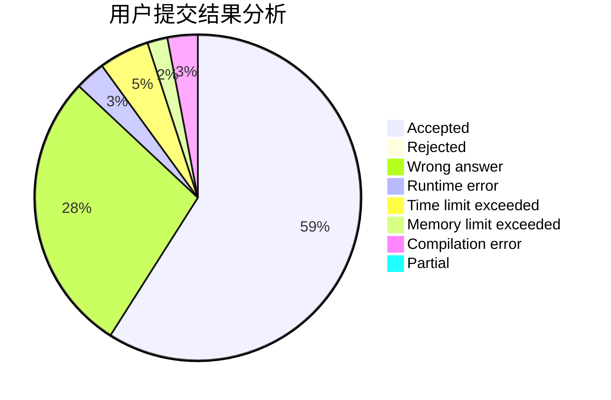
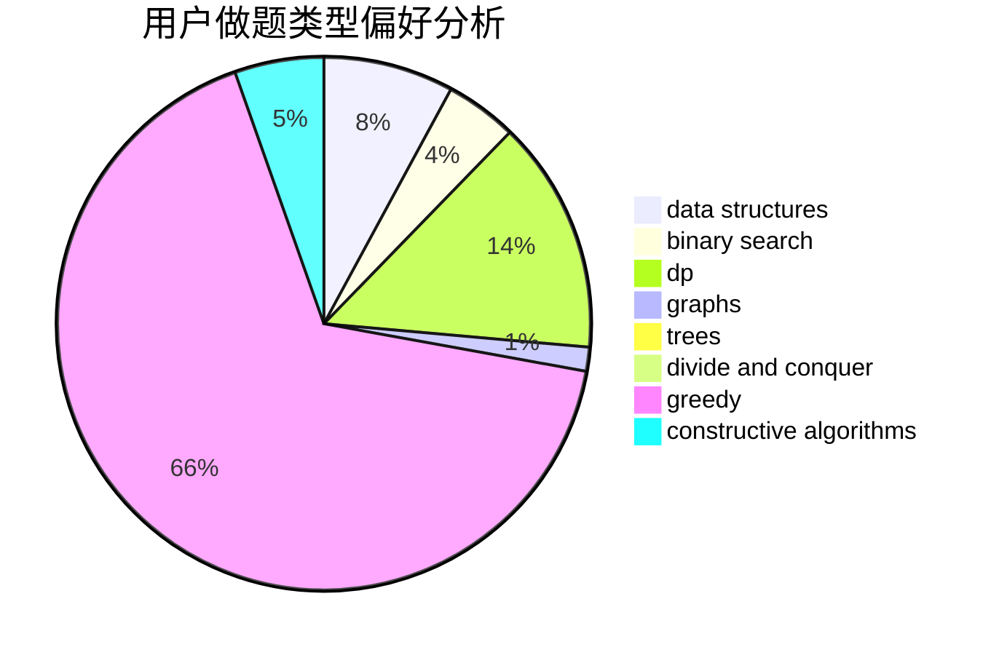
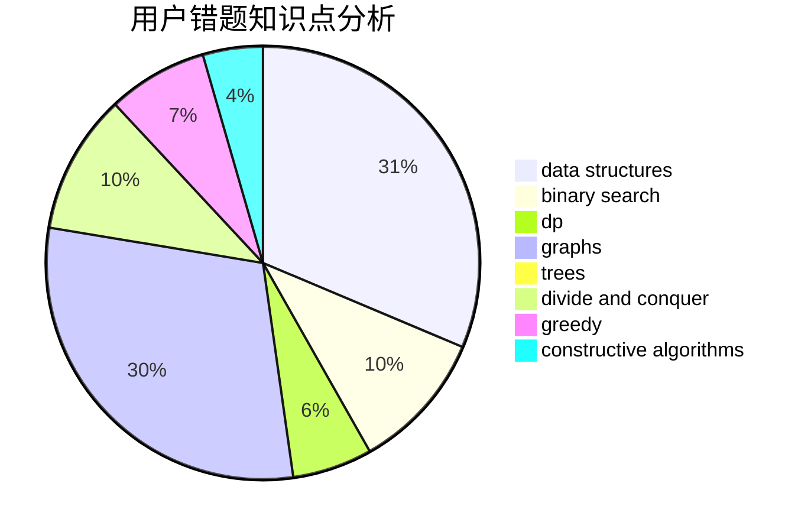

# youtsuha

<!-- tabs:start -->

#### **用户提交结果分析**

#### **用户做题类型偏好分析**

#### **用户错题知识点分析**

<!-- tabs:end -->
# 推荐题目
[1371A](https://codeforces.com/contest/1371/problem/A)		math		  
[699B](https://codeforces.com/contest/699/problem/B)		implementation		  
[1129D](https://codeforces.com/contest/1129/problem/D)		data structures,
                        dp		  
[204C](https://codeforces.com/contest/204/problem/C)		math,
                        probabilities		  
[1091E](https://codeforces.com/contest/1091/problem/E)		binary search,
                        data structures,
                        graphs,
                        greedy,
                        implementation,
                        math,
                        sortings		  
[114C](https://codeforces.com/contest/114/problem/C)		dsu,graphs,sortings,trees		  
[1060A](https://codeforces.com/contest/1060/problem/A)		brute force		  
[725D](https://codeforces.com/contest/725/problem/D)		data structures,
                        greedy		  
[1089M](https://codeforces.com/contest/1089/problem/M)		constructive algorithms,
                        graphs		  
[276E](https://codeforces.com/contest/276/problem/E)		data structures,
                        graphs,
                        trees		  
