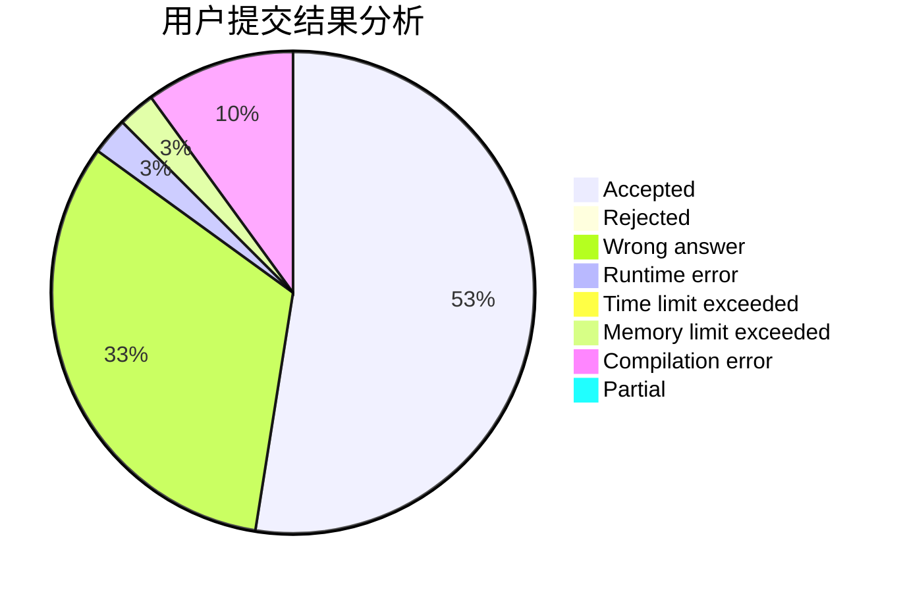
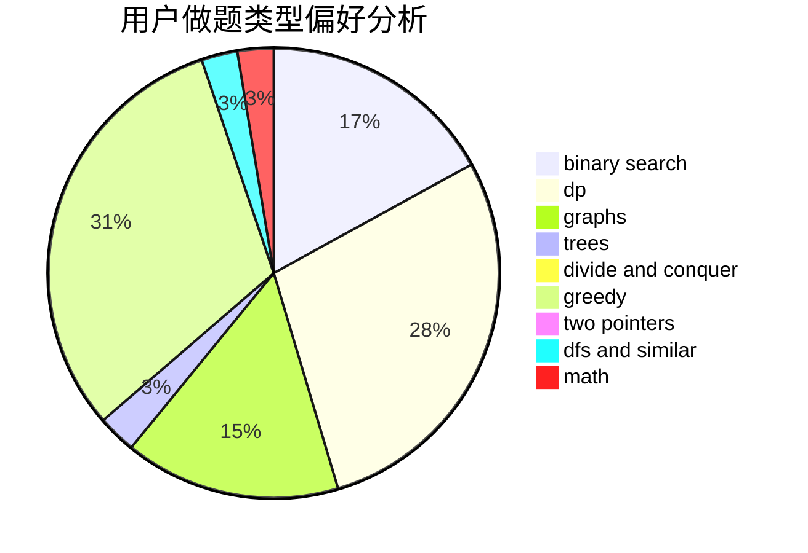

# youyou2005

<!-- tabs:start -->

#### **用户提交结果分析**

#### **用户做题类型偏好分析**

<!-- tabs:end -->
# 推荐题目
[993B](https://codeforces.com/contest/993/problem/B)
[1444D](https://codeforces.com/contest/1444/problem/D)
[998B](https://codeforces.com/contest/998/problem/B)
[946G](https://codeforces.com/contest/946/problem/G)
[1255A](https://codeforces.com/contest/1255/problem/A)
[246D](https://codeforces.com/contest/246/problem/D)
[295A](https://codeforces.com/contest/295/problem/A)
[965E](https://codeforces.com/contest/965/problem/E)
[734A](https://codeforces.com/contest/734/problem/A)
[1365G](https://codeforces.com/contest/1365/problem/G)
